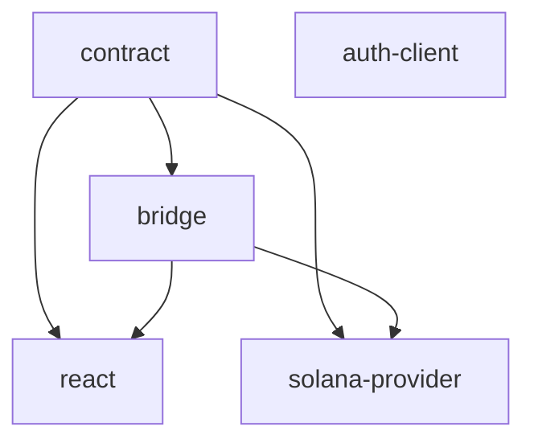

# Releasing

The Alien Miniapp SDK uses [changesets](https://github.com/changesets/changesets)
in canonical bot-driven mode. Versions, cascade patches, CHANGELOGs, and git
tags are all computed by the tool; the human's role is to declare intent on
feature PRs and approve two gates.

## Three manual gates

1. **Feature PR merge.** The developer adds a `.changeset/*.md` file declaring
   which packages bump and how. A maintainer reviews and squash-merges.
2. **Version PR merge.** A bot (`changesets/action`, in the `version-pr` job)
   opens or updates a `chore: release packages` PR on every push to `main`
   that has pending changesets. This job has only `contents: write` and
   `pull-requests: write` — no `id-token: write`, no environment gate, no
   OIDC token in scope. The maintainer reviews the computed bumps +
   CHANGELOGs + regenerated lockfile, then squash-merges.
3. **`npm-publish` environment approval.** Merging the Version PR triggers
   the `publish` job (a separate job, gated by the `npm-publish` GitHub
   Environment reviewer, the only job that holds `id-token: write`). A
   maintainer approves, and the publish loop runs in topological order.

## Adding a changeset

On any feature branch that touches code shipped to npm
(`packages/*/src/**`, `packages/*/package.json`, `packages/*/README.md`,
`packages/*/tsdown.config.ts`):

```bash
bun changeset
```

Interactive prompts pick:

- which packages bump (multi-select)
- the bump type per package (patch / minor / major)
- a one-line summary that becomes the CHANGELOG entry

This writes `.changeset/<random-id>.md`. Commit it with your code change.

The `changesets/bot` GitHub App (installed at the org level) comments on PRs
that lack a changeset to nudge you. The check is non-blocking — if you forget,
the PR is mergeable but the change just won't appear in the next Version PR.

## Cascade rule

When a package bumps, every internal package that depends on it gets a patch
bump too. This is enforced by `updateInternalDependents: always` in
`.changeset/config.json`.

| Bumping... | Auto-patches |
| --- | --- |
| `contract` | `bridge`, `react`, `solana-provider` |
| `bridge` | `react`, `solana-provider` |
| `auth-client` | (nothing) |
| `react` | (nothing) |
| `solana-provider` | (nothing) |

Examples (`vite-miniapp`, `solana-wallet-example`, `reown-appkit-example`) are
in the `ignore` list and never bump.

## Pre-release lines

### Beta (cycle-based)

A beta cycle uses changesets **pre mode**. Open a one-line PR to enter:

```bash
bun changeset pre enter beta
git add .changeset/pre.json && git commit -m "chore: enter beta pre mode"
```

While `.changeset/pre.json` exists, every Version PR ships as `x.y.z-beta.N`
(linear counter) to the `@beta` dist-tag. When ready for stable, open another
one-line PR:

```bash
bun changeset pre exit
git add .changeset/pre.json && git commit -m "chore: exit beta pre mode"
```

The next Version PR consolidates all accumulated beta changesets into a single
stable `x.y.z` to `@latest`.

### Alpha (same mechanism, different tag)

`bun changeset pre enter alpha`. No separate snapshot workflow — alphas flow
through the same Version PR loop.

### Stable

When `.changeset/pre.json` does not exist, every Version PR produces stable
`x.y.z` to `@latest`.

## Dist-tag derivation

The publish script derives the npm dist-tag from the version suffix in
`scripts/lib/tag.ts`:

- `2.1.0` → `latest`
- `2.1.0-beta` / `2.1.0-beta.3` → `beta`
- `2.1.0-alpha.1` → `alpha`
- `2.1.0-rc.0` → `rc`
- `2.1.0-alpha-20260528120000` → `alpha` (snapshot-style)

No maintainer ever picks the tag manually.

## Pinned workspace deps

Internal `workspace:*` references substitute to the **exact** version at pack
time (`bun pm pack` does this correctly under Bun; `npm pack` does not, which is
why we orchestrate publishing via the topological script). Consumers receive a
pinned dependency in the published tarball:

```jsonc
// inside the published @alien-id/miniapps-bridge tarball
"dependencies": {
  "@alien-id/miniapps-contract": "2.1.5" // pinned, not "^2.1.5"
}
```

This is intentional: the SDK is a coherent stack maintained together (like tRPC
or Apollo Client, not a plugin ecosystem). A `bridge@2.1.5` tarball declares it
was tested against exactly `contract@2.0.4`.

## Topological publish order

Derived at runtime from `packages/*/package.json` dependencies. The orchestrator
(`scripts/publish-topological.ts`) walks packages dependency-first so consumers
installing during the publish window never see a stale upstream.



Auth-client and contract are leaves. Bridge follows contract. React and
solana-provider follow bridge.

## JSON schemas for non-TS consumers

The `@alien-id/miniapps-contract` tarball ships
`artifacts/{events,methods}.schema.json`. npm CDNs serve them at stable,
version-pinned URLs the moment publish succeeds — no GitHub Release asset
attachment needed:

```
https://unpkg.com/@alien-id/miniapps-contract@<version>/artifacts/events.schema.json
https://cdn.jsdelivr.net/npm/@alien-id/miniapps-contract@<version>/artifacts/methods.schema.json
```

Drop `@<version>` to resolve to the `@latest` dist-tag.

## Force-push approval reset (Version PR)

`changesets/action` rewrites the `changeset-release/main` branch every time a
new changeset lands on `main`. If a reviewer previously approved the Version PR,
GitHub clears that approval on each force-push. **Always re-check the diff and
re-approve before merging.**

## Partial-failure recovery

If the publish workflow fails halfway through (transient network error, npm
hiccup):

1. Open the Actions run page and click **Re-run failed jobs**.
2. The orchestrator queries the npm registry for each package's version.
   Already-published packages are skipped; the loop resumes from the first
   failure.
3. The `npm-publish` environment reviewer gate fires again. Approve, and the
   resume continues.

**Never** edit `packages/*/package.json` versions or git tags by hand to "patch
around" a failure. The script is idempotent on re-run.

## Hotfix during a beta cycle

Pre mode is binary: while `.changeset/pre.json` exists, every Version PR ships
as `-beta.N`. Shipping a stable hotfix while a beta cycle is in progress costs
three PRs:

1. `bun changeset pre exit` (one-line PR)
2. The hotfix changeset PR → Version PR → publish stable
3. `bun changeset pre enter beta` (one-line PR)

If hotfix frequency is expected to be high, consider not entering pre mode at
all and shipping betas as ad-hoc `x.y.z-beta.N` releases via stable-mode
changesets.

## What's in the `.changeset/` directory

| File | Purpose |
| --- | --- |
| `config.json` | Cascade settings, changelog generator, ignore list for examples |
| `pre.json` (when present) | Marks the repo as being in pre mode; tracks which changesets have been versioned in the cycle |
| `<random-id>.md` | A pending release intent — waits in the queue until consumed by `changeset version` |
| `README.md` | Stock changesets readme |

## The workflows

| Workflow | Trigger | What it does |
| --- | --- | --- |
| `.github/workflows/release.yml` | `push: main` | Two jobs. `version-pr` (no env gate, no OIDC token): opens/updates the Version PR when changesets are pending; no-ops when they aren't. `publish` (env-gated, OIDC, depends on `version-pr` reporting `hasChangesets=false`): builds, runs the topological publish loop, runs `changeset tag`. |
| `.github/workflows/ci.yml` | `push: main` + `pull_request` | Lint, typecheck, test on every push and PR. On PRs only, also surfaces `changeset status` as an advisory check (never fails). `changesets/bot` GitHub App handles "you forgot a changeset" nudges conversationally. |

## Security posture

- **All third-party actions are SHA-pinned**, not tag-pinned. Defeats the
  tag-overwrite attack class (e.g. `tj-actions/changed-files` compromise of
  March 2025).
- **`version-pr` and `publish` are separate jobs.** The publish job is the
  only place `id-token: write` is granted; it never coexists with code that
  runs `bun install` against contributor-supplied manifests in a context
  that could exfiltrate the OIDC token (TanStack/Astro 2025 attack class).
- **`oven-sh/setup-bun` runs with `no-cache: true`** on both jobs in
  `release.yml`. Action caching during OIDC-holding workflows is a known
  exfiltration vector.
- **No long-lived `NPM_TOKEN`**. Every publish uses OIDC trusted publishing
  with sigstore provenance attached to each tarball. `NPM_TOKEN: ''` is
  explicitly set on the publish step to defeat any accidental fallback.
- **`harden-runner` egress is blocked** outside an explicit allowlist on
  both jobs. The `version-pr` allowlist excludes sigstore endpoints (it
  doesn't touch them); the `publish` allowlist includes them.
- **`persist-credentials: false`** on `actions/checkout` so the `GITHUB_TOKEN`
  is never written to git config — `changesets/action` re-injects via env
  when it needs to push.
- **Minimal `permissions:`** at workflow level (default-deny); each job opts
  into the specific permissions it needs.
- **`environment: npm-publish` reviewer gate** lives only on the `publish`
  job — Version PRs are created without environment gating so reviewers
  can see the proposed bumps before approving the eventual publish.
- **`changesets/bot` GitHub App** posts a comment on PRs missing a changeset
  — no custom CI gate code to maintain. `ci.yml` additionally surfaces
  `changeset status` as an advisory log line.

## Manual operator tasks (one-time, alongside migration)

### Blocking — must happen alongside merge

1. **Reconfigure npm trusted-publishers** for each of the five packages
   (`@alien-id/miniapps-{contract,bridge,react,auth-client,solana-provider}`)
   to authorize `.github/workflows/release.yml` with **the `publish` job**.
   Replaces the previous per-package workflow authorizations. Without this,
   OIDC publish fails with `EUNAUTHORIZED`.
2. **Verify the `npm-publish` GitHub Environment** reviewer list still
   matches the maintainer set in repo settings.
3. **Create `.github/CODEOWNERS`** (none exists today) and wire branch
   protection on `main` to require CODEOWNERS approval. Cover at minimum
   `.changeset/`, `.github/workflows/`, `scripts/`, `packages/*/package.json`,
   `RELEASING.md`, `SECURITY.md`, and `CLAUDE.md`. The bot pushes to
   `changeset-release/main`, not `main` directly, so the protection does
   not block automation.

### Choose your release line after merge

This PR leaves the repo with `2.1.0-beta` as the in-source baseline for all
five packages (matching what's already on the `@beta` dist-tag) and **no**
`.changeset/pre.json`. The next change you make determines the cut:

- **Continue the beta cycle** — open a one-line PR `bun changeset pre enter
  beta` before adding new feature changesets. The next Version PR ships
  `x.y.z-beta.N` to `@beta`.
- **Cut stable 2.x** — add normal changesets on feature PRs. The first
  Version PR consolidates the `2.1.0-beta` baseline to `2.1.0` (semver
  treats prereleases as below their target) and publishes to `@latest`.
  Note: `@latest` currently points at the 1.x line; consumers on `@latest`
  will see a major version jump.

### Recommended — install when convenient

- **Install the `changesets/bot` GitHub App** at the `alien-id` organisation
  level: https://github.com/apps/changeset-bot. Posts a non-blocking
  "missing changeset" comment on PRs that touch `packages/*` without a
  changeset. The system works fine without it — `ci.yml` also surfaces
  `changeset status` as an advisory log line — but the bot is a
  conversational nudge that becomes more valuable as the contributor count
  grows or external PRs land.

## Troubleshooting

### "no changesets found" but I made a code change

You forgot to run `bun changeset`. Run it now, commit the resulting
`.changeset/*.md`, push.

### Version PR's lockfile diff looks suspicious

The `ci:version` script runs `rm bun.lock && bun install` because Bun's
`bun install --no-frozen-lockfile` does not refresh workspace versions in
`bun.lock` (empirically-confirmed gotcha). A complete lockfile rewrite is
expected and correct.

### `npm publish` fails with EUNAUTHORIZED

The trusted-publisher configuration on npm is not authorising `release.yml`.
Check the package's npm settings page → "Trusted publishers" — the workflow
path must read `.github/workflows/release.yml`.

### Should I use `bun publish`?

No. Bun's `bun publish` lacks `--provenance` support, so sigstore attestation
is unavailable. The orchestrator uses `bun pm pack` + `npm publish <tgz>` so
the published artifact carries provenance.

### My changeset accidentally included an unrelated package

Edit the `.changeset/<id>.md` file directly. The front-matter is a YAML mapping
of package name → bump type; remove the line and commit.
