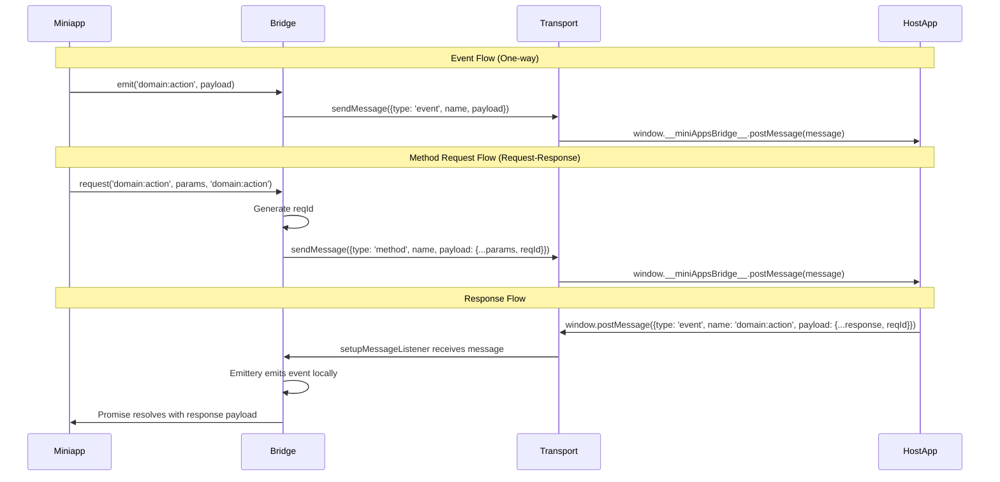

# Bridge Communication

The Bridge package provides a simple, type-safe communication channel between a miniapp (webview) and its host application. It enables bidirectional communication through events and methods, with full TypeScript type safety based on the contract package.

## Overview

**Important**: This bridge is designed to work **only** in the **Alien App** environment. The host app must be Alien App, which provides the required bridge interface.

The bridge uses the native bridge for communication:

- **Native Bridge**: Uses `window.__miniAppsBridge__.postMessage()` - **required** (provided by Alien App)

**Development Mode**: If the bridge is not available (e.g., running in a regular browser for development), the SDK will log warnings to the console but will not throw errors. This allows developers to test their miniapp code outside of Alien App. However, actual communication will not work - requests will timeout and events will not be received.

## Architecture



## Core Concepts

### Events

Events are one-way messages that can be sent from either the miniapp or the host app. They are used for notifications, state updates, or broadcasting information.

**Event Structure:**

```typescript
{
  type: 'event',
  name: EventName,        // e.g., 'auth.init:response.token'
  payload: EventPayload   // Type-safe payload from contract
}
```

### Event Naming Convention

Event names follow a strict naming convention: `<domain>:<action>`

**Format:**

- **Domain** (left of `:`) describes the subsystem or resource (nouns)
  - Examples: `auth`, `auth.init`, `storage.kv`, `ui.modal`
- **Action** (right of `:`) describes what happened or what is requested (verbs), optionally followed by variants/outcomes
  - Examples: `init`, `request`, `open`, `set`, `response.ok`, `response.token`, `handshake.error`

**Rules:**

- Use lowercase letters, digits, dots, and colons only
- No spaces, underscores, slashes, or double colons
- Two-word concepts use dot hierarchy: `auth.init:response.token` (not `authInit:responseToken`)
- Outcomes are encoded as dot variants: `auth:response.ok`, `auth:response.denied`
- Versioning: prefer payload `schemaVersion` field; if breaking change needed, append version: `auth:request.v2`

**Examples:**

- `bridge:ready`
- `bridge:handshake.start`
- `app:init`
- `auth:request`
- `auth.init:response.token`
- `storage.kv:get`
- `ui.modal:open`

### Methods

Methods are request-response patterns initiated by the miniapp. They allow the miniapp to request data or trigger actions in the host app and wait for a response.

**Method Structure:**

```typescript
{
  type: 'method',
  name: MethodName,       // e.g., 'auth.init:request'
  payload: MethodPayload & { reqId: string }  // Includes reqId for matching
}
```

### Method Naming Convention

Methods follow the same naming convention as events: `<domain>:<action>`

**Format:**

- **Domain** (left of `:`) describes the subsystem or resource (nouns)
  - Examples: `auth`, `auth.init`, `storage.kv`, `ui.modal`
- **Action** (right of `:`) describes what is being requested (verbs)
  - Examples: `request`, `get`, `set`, `create`, `delete`

**Rules:**

- Same rules as events: lowercase letters, digits, dots, and colons only
- No spaces, underscores, slashes, or double colons
- Two-word concepts use dot hierarchy: `auth.init:request` (not `authInit:request`)
- Versioning: prefer payload `schemaVersion` field; if breaking change needed, append version: `auth:request.v2`

**Examples:**

- `auth.init:request`
- `storage.kv:get`
- `storage.kv:set`
- `ui.modal:open`
- `payments.invoice:create`

**Response Structure:**

```typescript
{
  type: 'event',
  name: EventName,        // Response event name (specified in request)
  payload: EventPayload & { reqId: string }  // Includes matching reqId
}
```

## API Reference

### Event API

#### `on<T extends EventName>(name: T, listener: EventListener<T>): () => void`

Subscribe to an event from the host app.

```typescript
import { on } from '@alien-id/bridge';

const unsubscribe = on('auth.init:response.token', (payload) => {
  console.log('Received token:', payload.token);
  console.log('Request ID:', payload.reqId);
});

// Later, unsubscribe
unsubscribe();
```

#### `off<T extends EventName>(name: T, listener: EventListener<T>): void`

Unsubscribe from an event.

```typescript
import { off } from '@alien-id/bridge';

const listener = (payload) => {
  // Handle event
};

on('auth.init:response.token', listener);
// Later...
off('auth.init:response.token', listener);
```

#### `emit<T extends EventName>(name: T, payload: EventPayload<T>): Promise<void>`

Emit an event to the host app.

```typescript
import { emit } from '@alien-id/bridge';

await emit('auth.init:response.token', {
  token: 'my-token',
  reqId: 'optional-request-id',
});
```

### Method API

#### `request<M extends MethodName, E extends EventName>(method: M, params: MethodPayload<M>, responseEvent: E, options?: RequestOptions): Promise<EventPayload<E>>`

Send a method request to the host app and wait for a response.

```typescript
import { request } from '@alien-id/bridge';

// Basic usage
const response = await request(
  'auth.init:request',
  {
    appId: 'my-app-id',
    challenge: 'random-challenge',
  },
  'auth.init:response.token', // Response event name
);

console.log('Received token:', response.token);

// With custom options
const response = await request(
  'auth.init:request',
  { appId: 'my-app-id', challenge: 'challenge' },
  'auth.init:response.token',
  {
    reqId: 'custom-request-id', // Optional: custom request ID
    timeout: 5000,               // Optional: timeout in ms (default: 30000)
  },
);
```

**RequestOptions:**

- `reqId?: string` - Custom request ID (auto-generated if not provided)
- `timeout?: number` - Request timeout in milliseconds (default: 30000)

## Message Format

All messages follow this structure:

```typescript
interface Message {
  type: 'event' | 'method';
  name: EventName | MethodName;
  payload: EventPayload<EventName> | MethodPayload<MethodName>;
}
```

### Event Message Example

```typescript
{
  type: 'event',
  name: 'auth.init:response.token',
  payload: {
    token: 'abc123',
    reqId: 'req-456'  // Optional, included in response events
  }
}
```

### Method Message Example

```typescript
{
  type: 'method',
  name: 'auth.init:request',
  payload: {
    appId: 'my-app',
    challenge: 'random-string',
    reqId: 'req-789'  // Required for methods
  }
}
```

## Transport Layer

The bridge uses the native bridge provided by Alien App for communication:

### Transport Method

**Native Bridge** (Required): Uses `window.__miniAppsBridge__.postMessage(message)`

- Sends messages as JSON strings
- Provided by Alien App (the host app)
- **Required**: If the bridge is not available (not running in Alien App), sending messages will log a warning and the message will not be sent. This allows development testing outside of Alien App, but communication will not work.

### Message Reception

All platforms use `window.addEventListener('message', ...)` to receive messages. The bridge handles:

- **Object messages**: Directly processed
- **Stringified messages**: Automatically parsed from JSON (for compatibility with old browsers)

The transport layer automatically:

- Validates message structure
- Handles both object and stringified messages
- Provides error handling for unavailable windows or missing bridge

## Type Safety

All types are derived from the `@alien-id/contract` package:

- `EventName` - Union of all event names
- `EventPayload<T>` - Payload type for event `T`
- `MethodName` - Union of all method names
- `MethodPayload<T>` - Payload type for method `T`

This ensures compile-time type checking and IntelliSense support.

## Usage Examples

### Listening for Events

```typescript
import { on } from '@alien-id/bridge';

// Listen for auth token updates
on('auth.init:response.token', (payload) => {
  // Update UI or state
  updateAuthToken(payload.token);
});
```

### Sending Events

```typescript
import { emit } from '@alien-id/bridge';

// Notify host app of user action
await emit('auth.init:response.token', {
  token: 'user-action-token',
  reqId: 'action-123',
});
```

### Request-Response Pattern

```typescript
import { request } from '@alien-id/bridge';

async function initializeApp() {
  try {
    const authData = await request(
      'auth.init:request',
      {
        appId: 'my-app-id',
        challenge: generateChallenge(),
      },
      'auth.init:response.token',
    );
    
    // Use the response
    console.log('Authenticated:', authData.token);
  } catch (error) {
    console.error('Auth failed:', error);
  }
}
```

## Host App Implementation

The host app needs to:

1. **Listen for messages from the miniapp:**

    ```typescript
    // Alien App provides the bridge interface automatically
    // Messages are received via the native bridge interface
    ```

2. **Handle method requests:**

    ```typescript
    function handleMethod(methodName: string, payload: any) {
      const { reqId, ...params } = payload;
      
      switch (methodName) {
        case 'auth.init:request':
          handleAuthRequest(params, reqId);
          break;
        // ... other methods
      }
    }

    async function handleAuthRequest(params: any, reqId: string) {
      // Process request
      const token = await generateToken(params);
      
      // Send response
      sendToMiniapp({
        type: 'event',
        name: 'auth.init:response.token',
        payload: {
          token,
          reqId, // Must match the request
        },
      });
    }
    ```

### Compatibility Assessment

**Note**: Our bridge is designed to work only with Alien App as the host app. Alien App provides the required bridge interface.

✅ **Fully Compatible aspects:**

- ✅ Supports `window.__miniAppsBridge__.postMessage()` for mobile/desktop (provided by Alien App)
- ✅ Both use `window.addEventListener('message')` for receiving
- ✅ Both support request-response patterns
- ✅ Both include request IDs for matching

### Host App Setup

**Note**: This section is for reference only. Alien App already provides the bridge interface. If you're building a custom host app, you would need to implement the bridge interface similar to the example below.

The following example shows how Alien App initializes the bridge (using Flutter as an example, but it can be adapted to other frameworks like Kotlin, Swift, etc):

```dart
import 'dart:convert';
import 'package:webview_flutter/webview_flutter.dart';

class MiniappBridge {
  final WebViewController webViewController;

  MiniappBridge({
    required this.webViewController,
  }) {
    _setupMessageListener();
  }

  void _setupMessageListener() {
    webViewController.addJavaScriptChannel(
      '__miniAppsBridge__',
      onMessageReceived: (JavaScriptMessage message) {
        try {
          final data = json.decode(message.message) as Map<String, dynamic>;
          _handleMessage(data);
        } catch (e) {
          print('Error parsing message: $e');
        }
      },
    );
  }

  void _handleMessage(Map<String, dynamic> data) {
    final type = data['type'] as String?;
    final name = data['name'] as String?;
    final payload = data['payload'] as Map<String, dynamic>?;

    if (type == null || name == null || payload == null) {
      print('Invalid message format: $data');
      return;
    }

    if (type == 'method') {
      // Handle method requests from miniapp
      _handleMethodRequest(name, payload);
    }
  }

  void _handleMethodRequest(String methodName, Map<String, dynamic> payload) {
    switch (methodName) {
      case 'auth.init:request':
        // your method handling logic goes here
        // e.g. _handleGetAuthData(payload);
        break;

      default:
        print('Unknown method: $methodName');
        // Optionally send error response as an event here
    }
  }
}
```

## Best Practices

1. **Always specify the response event** when using `request()`:

   ```typescript
   // ✅ Good
   await request('auth.init:request', params, 'auth.init:response.token');
   
   // ❌ Bad - no way to match response
   await request('auth.init:request', params);
   ```

2. **Handle timeouts gracefully**:

   ```typescript
   try {
     const response = await request(method, params, event, { timeout: 5000 });
   } catch (error) {
     if (error.message.includes('timeout')) {
       // Handle timeout
     }
   }
   ```

3. **Clean up event listeners**:

   ```typescript
   const unsubscribe = on('domain:action', handler);
   // ... later
   unsubscribe(); // Important for memory management
   ```

4. **Use type-safe event names**:

   ```typescript
   // ✅ Good - type-checked
   on('auth.init:response.token', handler);
   
   // ❌ Bad - no type safety
   on('custom-event' as any, handler);
   ```

## Error Handling

The bridge handles errors gracefully:

- **Window unavailable**: Logs warning, no-op
- **Message send failure**: Logs error, no-op
- **Request timeout**: Rejects promise with timeout error
- **Invalid messages**: Filtered out by message listener

Always wrap `request()` calls in try-catch:

```typescript
try {
  const response = await request(method, params, event);
} catch (error) {
  // Handle error
}
```

## Performance Considerations

- **Emittery**: Uses efficient event handling with async support
- **Message batching**: Not supported (send messages individually)
- **Memory**: Event listeners are automatically cleaned up when using `request()`
- **Overhead**: Minimal - just message validation and Emittery dispatch

## Security Considerations

⚠️ **Important**: The bridge uses `'*'` as the target origin for `postMessage`. Alien App (the host app) handles security:

1. **Message origin validation**: Alien App validates message origins to ensure security
2. **Message structure validation**: Alien App validates message structure before processing
3. **Payload sanitization**: Alien App sanitizes payloads before use
4. **HTTPS**: Alien App uses HTTPS in production

**Note**: As a miniapp developer, you don't need to implement these security measures - Alien App handles them. However, you should still validate and sanitize any data you receive from Alien App before using it in your miniapp.

## Troubleshooting

### Messages not received

- **Verify you're running in Alien App**: The bridge only works in Alien App environment. If you see warnings about the bridge not being available, you're not running in Alien App.
- Check browser console for warnings (the SDK logs warnings when the bridge is unavailable)
- Ensure Alien App (host app) is properly initialized and listening for messages
- Verify `window.__miniAppsBridge__` is available (this is provided by Alien App)

### Request timeouts

- **Verify you're running in Alien App**: If you're not running in Alien App, requests will timeout because the bridge is not available
- Increase timeout value if needed
- Check if Alien App (host app) is responding
- Verify response event name matches
- Check if `reqId` matches between request and response

### Type errors

- Ensure contract package is up to date
- Check event/method names match contract definitions
- Verify payload types match contract types
