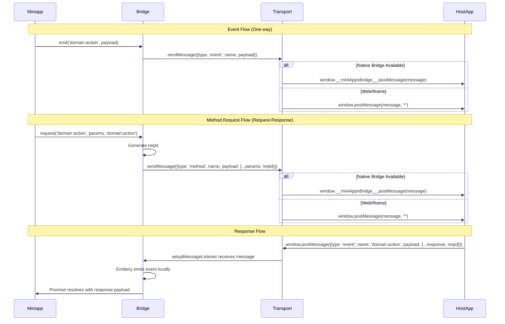

# Bridge Communication

The Bridge package provides a simple, type-safe communication channel between a miniapp (webview) and its host application. It enables bidirectional communication through events and methods, with full TypeScript type safety based on the contract package.

## Overview

The bridge automatically detects the communication channel and uses the appropriate method:

1. **Native Bridge** (Mobile/Desktop): Uses `window.__miniAppsBridge__.postMessage()` if available
2. **PostMessage** (Web/Iframe): Falls back to `window.postMessage()` for web-based clients

This makes it compatible with:

- **Web clients**: Iframe-based miniapps using `window.postMessage`
- **Mobile clients**: WebView-based miniapps (iOS WKWebView, Android WebView) using native bridge
- **Desktop clients**: Electron, Tauri, or similar webview-based applications using native bridge

## Architecture



## Core Concepts

### Events

Events are one-way messages that can be sent from either the miniapp or the host app. They are used for notifications, state updates, or broadcasting information.

**Event Structure:**

```typescript
{
  type: 'event',
  name: EventName,        // e.g., 'auth.init:response.token'
  payload: EventPayload   // Type-safe payload from contract
}
```

### Event Naming Convention

Event names follow a strict naming convention: `<domain>:<action>`

**Format:**

- **Domain** (left of `:`) describes the subsystem or resource (nouns)
  - Examples: `auth`, `auth.init`, `storage.kv`, `ui.modal`
- **Action** (right of `:`) describes what happened or what is requested (verbs), optionally followed by variants/outcomes
  - Examples: `init`, `request`, `open`, `set`, `response.ok`, `response.token`, `handshake.error`

**Rules:**

- Use lowercase letters, digits, dots, and colons only
- No spaces, underscores, slashes, or double colons
- Two-word concepts use dot hierarchy: `auth.init:response.token` (not `authInit:responseToken`)
- Outcomes are encoded as dot variants: `auth:response.ok`, `auth:response.denied`
- Versioning: prefer payload `schemaVersion` field; if breaking change needed, append version: `auth:request.v2`

**Examples:**

- `bridge:ready`
- `bridge:handshake.start`
- `app:init`
- `auth:request`
- `auth.init:response.token`
- `storage.kv:get`
- `ui.modal:open`

### Methods

Methods are request-response patterns initiated by the miniapp. They allow the miniapp to request data or trigger actions in the host app and wait for a response.

**Method Structure:**

```typescript
{
  type: 'method',
  name: MethodName,       // e.g., 'auth.init:request'
  payload: MethodPayload & { reqId: string }  // Includes reqId for matching
}
```

### Method Naming Convention

Methods follow the same naming convention as events: `<domain>:<action>`

**Format:**

- **Domain** (left of `:`) describes the subsystem or resource (nouns)
  - Examples: `auth`, `auth.init`, `storage.kv`, `ui.modal`
- **Action** (right of `:`) describes what is being requested (verbs)
  - Examples: `request`, `get`, `set`, `create`, `delete`

**Rules:**

- Same rules as events: lowercase letters, digits, dots, and colons only
- No spaces, underscores, slashes, or double colons
- Two-word concepts use dot hierarchy: `auth.init:request` (not `authInit:request`)
- Versioning: prefer payload `schemaVersion` field; if breaking change needed, append version: `auth:request.v2`

**Examples:**

- `auth.init:request`
- `storage.kv:get`
- `storage.kv:set`
- `ui.modal:open`
- `payments.invoice:create`

**Response Structure:**

```typescript
{
  type: 'event',
  name: EventName,        // Response event name (specified in request)
  payload: EventPayload & { reqId: string }  // Includes matching reqId
}
```

## API Reference

### Event API

#### `on<T extends EventName>(name: T, listener: EventListener<T>): () => void`

Subscribe to an event from the host app.

```typescript
import { on } from '@alien-id/bridge';

const unsubscribe = on('auth.init:response.token', (payload) => {
  console.log('Received token:', payload.token);
  console.log('Request ID:', payload.reqId);
});

// Later, unsubscribe
unsubscribe();
```

#### `off<T extends EventName>(name: T, listener: EventListener<T>): void`

Unsubscribe from an event.

```typescript
import { off } from '@alien-id/bridge';

const listener = (payload) => {
  // Handle event
};

on('auth.init:response.token', listener);
// Later...
off('auth.init:response.token', listener);
```

#### `emit<T extends EventName>(name: T, payload: EventPayload<T>): Promise<void>`

Emit an event to the host app.

```typescript
import { emit } from '@alien-id/bridge';

await emit('auth.init:response.token', {
  token: 'my-token',
  reqId: 'optional-request-id',
});
```

### Method API

#### `request<M extends MethodName, E extends EventName>(method: M, params: MethodPayload<M>, responseEvent: E, options?: RequestOptions): Promise<EventPayload<E>>`

Send a method request to the host app and wait for a response.

```typescript
import { request } from '@alien-id/bridge';

// Basic usage
const response = await request(
  'auth.init:request',
  {
    appId: 'my-app-id',
    challenge: 'random-challenge',
  },
  'auth.init:response.token', // Response event name
);

console.log('Received token:', response.token);

// With custom options
const response = await request(
  'auth.init:request',
  { appId: 'my-app-id', challenge: 'challenge' },
  'auth.init:response.token',
  {
    reqId: 'custom-request-id', // Optional: custom request ID
    timeout: 5000,               // Optional: timeout in ms (default: 30000)
  },
);
```

**RequestOptions:**

- `reqId?: string` - Custom request ID (auto-generated if not provided)
- `timeout?: number` - Request timeout in milliseconds (default: 30000)

## Message Format

All messages follow this structure:

```typescript
interface Message {
  type: 'event' | 'method';
  name: EventName | MethodName;
  payload: EventPayload<EventName> | MethodPayload<MethodName>;
}
```

### Event Message Example

```typescript
{
  type: 'event',
  name: 'auth.init:response.token',
  payload: {
    token: 'abc123',
    reqId: 'req-456'  // Optional, included in response events
  }
}
```

### Method Message Example

```typescript
{
  type: 'method',
  name: 'auth.init:request',
  payload: {
    appId: 'my-app',
    challenge: 'random-string',
    reqId: 'req-789'  // Required for methods
  }
}
```

## Transport Layer

The bridge automatically selects the appropriate transport method based on the environment:

### Transport Priority

1. **Native Bridge** (Mobile/Desktop): If `window.__miniAppsBridge__` is available, uses `window.__miniAppsBridge__.postMessage(message)`
   - Sends messages as objects (not stringified)
   - Used by mobile and desktop clients that inject the bridge

2. **PostMessage** (Web/Iframe): Falls back to `window.postMessage(message, '*')`
   - Uses `window.parent.postMessage()` if in an iframe
   - Uses `window.postMessage()` if not in an iframe
   - Sends messages as objects (modern browsers support structured cloning)

### Message Reception

All platforms use `window.addEventListener('message', ...)` to receive messages. The bridge handles:

- **Object messages**: Directly processed
- **Stringified messages**: Automatically parsed from JSON (for compatibility with old browsers)

The transport layer automatically:

- Detects if native bridge is available
- Detects if running in an iframe/webview
- Handles both object and stringified messages
- Validates message structure
- Provides error handling for unavailable windows

## Type Safety

All types are derived from the `@alien-id/contract` package:

- `EventName` - Union of all event names
- `EventPayload<T>` - Payload type for event `T`
- `MethodName` - Union of all method names
- `MethodPayload<T>` - Payload type for method `T`

This ensures compile-time type checking and IntelliSense support.

## Usage Examples

### Listening for Events

```typescript
import { on } from '@alien-id/bridge';

// Listen for auth token updates
on('auth.init:response.token', (payload) => {
  // Update UI or state
  updateAuthToken(payload.token);
});
```

### Sending Events

```typescript
import { emit } from '@alien-id/bridge';

// Notify host app of user action
await emit('auth.init:response.token', {
  token: 'user-action-token',
  reqId: 'action-123',
});
```

### Request-Response Pattern

```typescript
import { request } from '@alien-id/bridge';

async function initializeApp() {
  try {
    const authData = await request(
      'auth.init:request',
      {
        appId: 'my-app-id',
        challenge: generateChallenge(),
      },
      'auth.init:response.token',
    );
    
    // Use the response
    console.log('Authenticated:', authData.token);
  } catch (error) {
    console.error('Auth failed:', error);
  }
}
```

## Host App Implementation

The host app needs to:

1. **Listen for messages from the miniapp:**

    ```typescript
    // Web (iframe)
    iframe.contentWindow.addEventListener('message', (event) => {
      const message = event.data;
      
      if (message.type === 'method') {
        handleMethod(message.name, message.payload);
      } else if (message.type === 'event') {
        handleEvent(message.name, message.payload);
      }
    });

    // Mobile (WebView)
    // Platform-specific implementation
    ```

2. **Send events to the miniapp:**

    ```typescript
    // Web (iframe)
    iframe.contentWindow.postMessage({
      type: 'event',
      name: 'auth.init:response.token',
      payload: {
        token: 'new-token',
        reqId: requestId, // Include if responding to a method
      },
    }, '*');

    // Mobile (WebView)
    // Platform-specific implementation
    ```

3. **Handle method requests:**

    ```typescript
    function handleMethod(methodName: string, payload: any) {
      const { reqId, ...params } = payload;
      
      switch (methodName) {
        case 'auth.init:request':
          handleAuthRequest(params, reqId);
          break;
        // ... other methods
      }
    }

    async function handleAuthRequest(params: any, reqId: string) {
      // Process request
      const token = await generateToken(params);
      
      // Send response
      sendToMiniapp({
        type: 'event',
        name: 'auth.init:response.token',
        payload: {
          token,
          reqId, // Must match the request
        },
      });
    }
    ```

## Compatibility with Open Mini Apps Standard

Our bridge implementation has some differences from the [Open Mini Apps communication standard](https://raw.githubusercontent.com/open-mini-apps/monorepo/refs/heads/main/apps/docs/ru/communication.md):

### Similarities ✅

- Uses `window.postMessage` for web-based communication
- Supports request-response pattern with request IDs
- Event-driven architecture
- Type-safe payloads
- Request IDs included in payload for matching responses

### Differences ⚠️

1. **Message Structure**:
    - **Open Mini Apps**: `{ name, payload, requestId? }` (requestId at top level)
    - **Our Bridge**: `{ type: 'event' | 'method', name, payload }` (reqId inside payload)
    - We use a `type` field to distinguish events from methods explicitly
    - Request ID is nested in the payload rather than at the top level

2. **Request ID Naming**:
    - **Open Mini Apps**: `requestId` (camelCase, at top level)
    - **Our Bridge**: `reqId` (camelCase, inside payload)
    - Both use camelCase, but placement differs

3. **JSON Stringification**:
    - **Open Mini Apps**: Requires `JSON.stringify()` for web clients (for older browser compatibility)
    - **Our Bridge**: Sends objects directly (modern browsers support structured cloning)
    - Our approach is simpler but may not work in very old browsers

4. **Mobile Bridge Interface**:
    - **Open Mini Apps**: Requires `window.__miniAppsBridge__.postMessage()` for mobile/desktop
    - **Our Bridge**: ✅ **Now supports both!** Uses `window.__miniAppsBridge__.postMessage()` if available, falls back to `window.postMessage()`
    - Our approach automatically detects and uses the appropriate method

5. **Event Handling**:
    - **Open Mini Apps**: Manual event listener setup with `window.addEventListener('message')`
    - **Our Bridge**: Uses Emittery for better event management, async support, and automatic cleanup

6. **Method-Event Distinction**:
    - **Open Mini Apps**: Methods identified by presence of `requestId` (required for methods)
    - **Our Bridge**: Methods explicitly marked with `type: 'method'`
    - Our approach is more explicit and type-safe

### Compatibility Assessment

**High Compatibility**: Our bridge is now highly compatible with Open Mini Apps-compliant host apps:

✅ **Fully Compatible aspects:**

- ✅ Supports `window.__miniAppsBridge__.postMessage()` for mobile/desktop
- ✅ Falls back to `window.postMessage()` for web clients
- ✅ Both use `window.addEventListener('message')` for receiving
- ✅ Both support request-response patterns
- ✅ Both include request IDs for matching

⚠️ **Minor differences:**

- Host app must handle our message format (`type` field)
- Host app must extract `reqId` from payload instead of top level
- We send objects directly (not stringified) - modern browsers support this

### Host App Setup

For **mobile/desktop clients**, the host app should initialize the bridge. The following example uses Flutter, but it can be adapted to other frameworks (Kotlin, Swift, etc).

```dart
import 'dart:convert';
import 'package:webview_flutter/webview_flutter.dart';

class MiniappBridge {
  final WebViewController webViewController;

  MiniappBridge({
    required this.webViewController,
  }) {
    _setupMessageListener();
  }

  void _setupMessageListener() {
    webViewController.addJavaScriptChannel(
      '__miniAppsBridge__',
      onMessageReceived: (JavaScriptMessage message) {
        try {
          final data = json.decode(message.message) as Map<String, dynamic>;
          _handleMessage(data);
        } catch (e) {
          print('Error parsing message: $e');
        }
      },
    );
  }

  void _handleMessage(Map<String, dynamic> data) {
    final type = data['type'] as String?;
    final name = data['name'] as String?;
    final payload = data['payload'] as Map<String, dynamic>?;

    if (type == null || name == null || payload == null) {
      print('Invalid message format: $data');
      return;
    }

    if (type == 'method') {
      // Handle method requests from miniapp
      _handleMethodRequest(name, payload);
    }
  }

  void _handleMethodRequest(String methodName, Map<String, dynamic> payload) {
    switch (methodName) {
      case 'auth.init:request':
        // your method handling logic goes here
        // e.g. _handleGetAuthData(payload);
        break;

      default:
        print('Unknown method: $methodName');
        // Optionally send error response as an event here
    }
  }
}
```

For **web clients** (iframe), the host app should listen for `postMessage`:

```typescript
iframe.contentWindow.addEventListener('message', (event) => {
  const message = event.data;
  // Handle message from miniapp
});
```

The miniapp automatically uses the appropriate method - no code changes needed!

### Migration Notes

Our bridge is now compatible with Open Mini Apps standard. The main differences are:

1. **Message format**: We use `{ type, name, payload }` instead of `{ name, payload, requestId }`
2. **Request ID location**: `reqId` is inside `payload` instead of at the top level
3. **No stringification**: We send objects directly (modern browsers support this)

**Recommendation**: Our bridge automatically detects and uses the native bridge when available, making it fully compatible with Open Mini Apps-compliant host apps.

## Best Practices

1. **Always specify the response event** when using `request()`:

   ```typescript
   // ✅ Good
   await request('auth.init:request', params, 'auth.init:response.token');
   
   // ❌ Bad - no way to match response
   await request('auth.init:request', params);
   ```

2. **Handle timeouts gracefully**:

   ```typescript
   try {
     const response = await request(method, params, event, { timeout: 5000 });
   } catch (error) {
     if (error.message.includes('timeout')) {
       // Handle timeout
     }
   }
   ```

3. **Clean up event listeners**:

   ```typescript
   const unsubscribe = on('domain:action', handler);
   // ... later
   unsubscribe(); // Important for memory management
   ```

4. **Use type-safe event names**:

   ```typescript
   // ✅ Good - type-checked
   on('auth.init:response.token', handler);
   
   // ❌ Bad - no type safety
   on('custom-event' as any, handler);
   ```

## Error Handling

The bridge handles errors gracefully:

- **Window unavailable**: Logs warning, no-op
- **Message send failure**: Logs error, no-op
- **Request timeout**: Rejects promise with timeout error
- **Invalid messages**: Filtered out by message listener

Always wrap `request()` calls in try-catch:

```typescript
try {
  const response = await request(method, params, event);
} catch (error) {
  // Handle error
}
```

## Performance Considerations

- **Emittery**: Uses efficient event handling with async support
- **Message batching**: Not supported (send messages individually)
- **Memory**: Event listeners are automatically cleaned up when using `request()`
- **Overhead**: Minimal - just message validation and Emittery dispatch

## Security Considerations

⚠️ **Important**: The bridge uses `'*'` as the target origin for `postMessage`. In production:

1. **Validate message origin** in the host app:

   ```typescript
   window.addEventListener('message', (event) => {
     if (event.origin !== 'https://trusted-domain.com') {
       return; // Ignore untrusted messages
     }
     // Process message
   });
   ```

2. **Validate message structure** before processing
3. **Sanitize payloads** before use
4. **Use HTTPS** in production

## Troubleshooting

### Messages not received

- Check if running in iframe/webview context
- Verify `window.postMessage` is available
- Check browser console for errors
- Ensure host app is listening for messages

### Request timeouts

- Increase timeout value
- Check if host app is responding
- Verify response event name matches
- Check if `reqId` matches between request and response

### Type errors

- Ensure contract package is up to date
- Check event/method names match contract definitions
- Verify payload types match contract types
