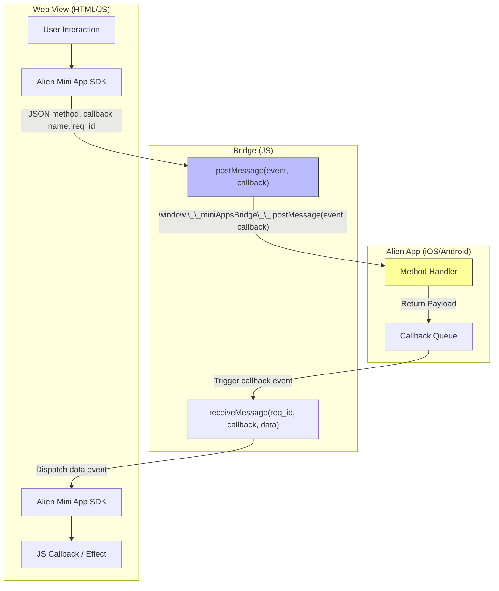

## Alien Mini Apps

Alien Mini Apps empower developers to build versatile interfaces directly within the Alien App. Our SDK provides a seamless connection between Alien ID and your web applications.

### Overview

Mini Apps consist of the following main components:

- Web application, deployed to your domain
- manifest.json, that contains metadata about your application, e.g. name, description, icon, domain, permissions. More info on manifest.json available in [manifest.md](manifest.md)
- Provider id created at the [Developer Portal](https://dev.alien.org).

### Setting up

When your web application is ready for deployment, you need to create a `manifest.json` and place inside `.well-known/manifest.json` directory on your website. More info in [manifest.md](manifest.md).

> Open question: put provider id inside manifest.json?

Register your application at the [Developer Portal](https://dev.alien.org) to get your provider credentials. The provider id is a unique identifier of your Mini App.

More info on providers: https://dev.alien.org/docs/what-is-alien-provider

### Communication between web and native apps

All communications between web and mobile applications are facilitated through a bidirectional bridge that connects the WebView environment to the native Alien Application.

Shema for WebView to Alien App communication is defined below.

To synchronize the communication, we generate a unique request id (req_id on the diagram). This id acts as a correlation key, allowing the application to map the outbound request to its corresponding native callback.

todo: schema for other way communications

### Auth

Alien Mini Apps utilize Alien SSO API for authentication.

todo: auth flow diagram, events

### Sessions

This session represents a permanent, verified connection between the user (their Alien ID) and your Mini App (the provider). The same session is reused for all subsequent authentications by that user with your application.

More info on sessions: https://dev.alien.org/docs/what-is-alien-session

### Integration

todo

### React integration

todo
