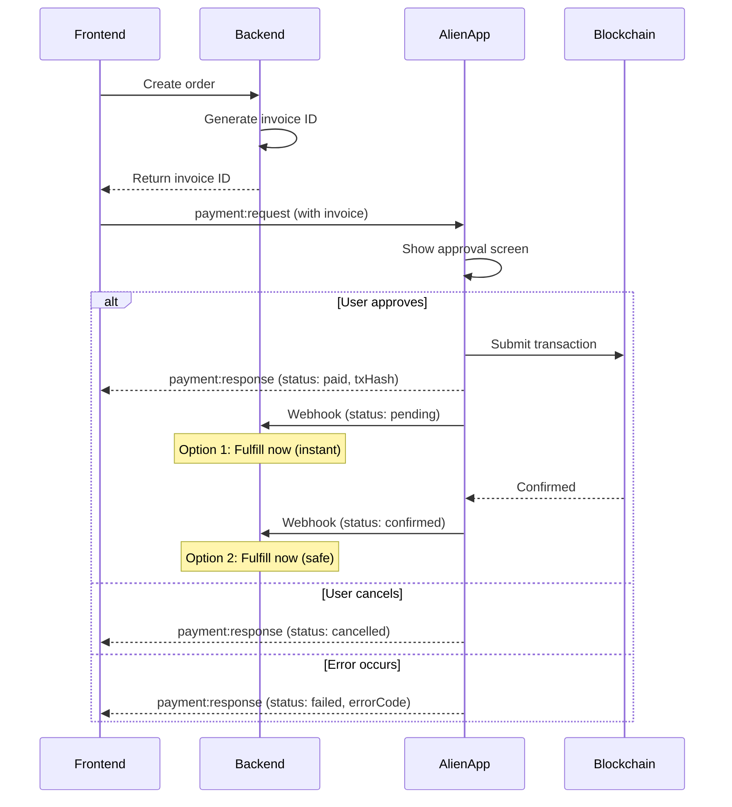

# Payments

Accept payments in your Mini App using the Alien payment system. Users can pay with tokens on Solana or Alien networks.

## Overview

The payment flow uses a two-webhook system, giving you control over when to fulfill orders:

1. Your backend creates an order and generates an `invoice` ID
2. Your frontend requests payment with the `invoice`
3. User approves (or rejects) in the Alien App
4. Transaction is broadcast to the blockchain
5. Your backend receives **first webhook** (`pending`) - transaction sent
6. Your backend receives **second webhook** (`confirmed`) - transaction confirmed on-chain

**You choose when to fulfill:**

- **On `pending`** - Instant fulfillment, better UX, small risk of failed tx
- **On `confirmed`** - Safe fulfillment, user waits for confirmation

## Flow Diagram



## Usage

### Basic Payment Request

```typescript
import { request } from '@alien-id/bridge';

const response = await request(
  'payment:request',
  {
    recipient: '0x1234...', // Your wallet address
    amount: '1000000',      // Amount in smallest unit (e.g., lamports)
    token: 'SOL',           // Token identifier
    network: 'solana',      // 'solana' or 'alien'
    invoice: 'order_abc123' // Your order/invoice ID
  },
  'payment:response'
);

if (response.status === 'paid') {
  console.log('Payment successful:', response.txHash);
} else if (response.status === 'cancelled') {
  console.log('User cancelled');
} else if (response.status === 'failed') {
  console.log('Payment failed:', response.errorCode);
}
```

### With Display Fields

Show item details on the approval screen:

```typescript
const response = await request(
  'payment:request',
  {
    recipient: '0x1234...',
    amount: '5000000',
    token: 'ALIEN',
    network: 'alien',
    invoice: 'order_xyz789',

    // Optional display fields
    title: 'Premium Subscription',
    caption: '1 month of premium features',
    iconUrl: 'https://yourapp.com/premium-icon.png',
    quantity: 1
  },
  'payment:response'
);
```

### React Hook

The `usePayment` hook provides a simple, type-safe way to handle payments with full state management and callbacks.

```tsx
import { usePayment } from '@alien-id/react';

function BuyButton({ orderId, price }: { orderId: string; price: string }) {
  const {
    pay,
    isLoading,
    isPaid,
    isCancelled,
    isFailed,
    txHash,
    errorCode,
    reset,
  } = usePayment({
    // Optional callbacks
    onPaid: (txHash) => console.log('Payment successful:', txHash),
    onCancelled: () => console.log('User cancelled'),
    onFailed: (code, error) => console.error('Payment failed:', code, error),
  });

  const handleBuy = () => pay({
    recipient: 'your-wallet-address',
    amount: price,
    token: 'SOL',
    network: 'solana',
    invoice: orderId,
    title: 'Game Credits',
    quantity: 100,
  });

  if (isPaid) {
    return (
      <div>
        <p>Thank you! TX: {txHash}</p>
        <button onClick={reset}>Buy Again</button>
      </div>
    );
  }

  if (isCancelled) {
    return (
      <div>
        <p>Payment cancelled</p>
        <button onClick={reset}>Try Again</button>
      </div>
    );
  }

  if (isFailed) {
    return (
      <div>
        <p>Payment failed: {errorCode}</p>
        <button onClick={reset}>Try Again</button>
      </div>
    );
  }

  return (
    <button onClick={handleBuy} disabled={isLoading}>
      {isLoading ? 'Processing...' : 'Buy Now'}
    </button>
  );
}
```

#### Hook Options

| Option | Type | Description |
| ------ | ---- | ----------- |
| `timeout` | `number` | Request timeout in ms (default: 120000) |
| `onPaid` | `(txHash: string) => void` | Called when payment succeeds |
| `onCancelled` | `() => void` | Called when user cancels |
| `onFailed` | `(code, error?) => void` | Called when payment fails |
| `onStatusChange` | `(status) => void` | Called on any status change |

#### Hook Return Values

| Value | Type | Description |
| ----- | ---- | ----------- |
| `pay` | `(params) => Promise` | Initiate a payment |
| `reset` | `() => void` | Reset state to idle |
| `status` | `PaymentStatus` | Current status |
| `isLoading` | `boolean` | Payment in progress |
| `isPaid` | `boolean` | Payment successful |
| `isCancelled` | `boolean` | User cancelled |
| `isFailed` | `boolean` | Payment failed |
| `txHash` | `string?` | Transaction hash (when paid) |
| `errorCode` | `string?` | Error code (when failed) |
| `error` | `Error?` | Error object (when failed) |
| `supported` | `boolean` | Method supported by host |

## Request Fields

| Field | Type | Required | Description |
| ----- | ---- | -------- | ----------- |
| `recipient` | `string` | Yes | Wallet address to receive payment |
| `amount` | `string` | Yes | Amount in token's smallest unit |
| `token` | `string` | Yes | Token identifier (e.g., 'SOL', 'ALIEN') |
| `network` | `string` | Yes | Network: 'solana' or 'alien' |
| `invoice` | `string` | Yes | Your order/invoice ID for backend correlation |
| `title` | `string` | No | Item title for approval screen |
| `caption` | `string` | No | Item description for approval screen |
| `iconUrl` | `string` | No | Item icon URL for approval screen |
| `quantity` | `number` | No | Quantity of items |
| `test` | `boolean` | No | Test mode - no real payment, webhooks include `test: true` |

## Response Fields

| Field | Type | Description |
| ----- | ---- | ----------- |
| `status` | `'paid' \| 'cancelled' \| 'failed'` | Payment result |
| `txHash` | `string?` | Transaction hash (when `status` is 'paid') |
| `errorCode` | `string?` | Error code (when `status` is 'failed') |

### Status Values

| Status | Meaning | Action |
| ------ | ------- | ------ |
| `paid` | User approved, transaction broadcast | Show success, backend handles fulfillment via webhook |
| `cancelled` | User manually rejected | Show cancellation message |
| `failed` | Error before broadcast | Check `errorCode`, show error |

> **Note:** The `paid` status means the transaction was **broadcast**, not confirmed. Your backend receives webhooks for `pending` → `confirmed` (or `failed`) to track the actual on-chain status.

### Error Codes

| Code | Meaning |
| ---- | ------- |
| `insufficient_balance` | User doesn't have enough tokens |
| `network_error` | Blockchain network issue |
| `unknown` | Unexpected error |

## Backend Integration

### Webhook Setup

Your backend receives two webhooks per successful payment:

1. **`pending`** - Transaction broadcast, not yet confirmed
2. **`confirmed`** - Transaction confirmed on-chain (n confirmations)

You can also receive a **`failed`** webhook if the transaction fails after being broadcast.

```typescript
// Example webhook handler (Node.js/Express)
app.post('/webhooks/alien-payment', async (req, res) => {
  const { invoice, txHash, status, amount, token, network } = req.body;

  const order = await Order.findByInvoice(invoice);

  if (!order) {
    return res.status(404).json({ error: 'Order not found' });
  }

  switch (status) {
    case 'pending':
      // Transaction broadcast - choose your strategy:

      // Option A: Instant fulfillment (better UX, small risk)
      // Good for: digital goods, in-app items, low-value purchases
      await order.update({ status: 'pending', txHash });
      await order.fulfill();
      break;

      // Option B: Just track, wait for confirmation
      // Good for: high-value items, physical goods
      // await order.update({ status: 'pending', txHash });
      // break;

    case 'confirmed':
      // Transaction confirmed on-chain
      await order.update({ status: 'confirmed' });

      // If you didn't fulfill on pending, fulfill now
      if (!order.fulfilled) {
        await order.fulfill();
      }
      break;

    case 'failed':
      // Transaction failed after broadcast
      await order.update({ status: 'failed' });

      // If you fulfilled on pending, handle the reversal
      if (order.fulfilled) {
        await order.reverse();
      }
      break;
  }

  res.json({ success: true });
});
```

### Webhook Payload

| Field | Type | Description |
| ----- | ---- | ----------- |
| `invoice` | `string` | Your order/invoice ID |
| `status` | `'pending' \| 'confirmed' \| 'failed'` | Transaction status |
| `txHash` | `string` | Transaction hash |
| `amount` | `string` | Amount paid |
| `token` | `string` | Token used |
| `network` | `string` | Network used |

### Order Creation

```typescript
// Create order endpoint
app.post('/api/orders', async (req, res) => {
  const { item, quantity } = req.body;

  // Generate unique invoice ID
  const invoice = `order_${crypto.randomUUID()}`;

  // Calculate price
  const price = calculatePrice(item, quantity);

  // Store order
  const order = await Order.create({
    invoice,
    item,
    quantity,
    amount: price.amount,
    token: price.token,
    network: price.network,
    status: 'pending'
  });

  res.json({
    invoice: order.invoice,
    amount: order.amount,
    token: order.token,
    network: order.network,
    recipient: process.env.MERCHANT_WALLET
  });
});
```

## Best Practices

1. **Always use webhooks for fulfillment** - Don't rely solely on the frontend response. Webhooks are the source of truth.

2. **Choose your fulfillment strategy wisely:**
   - **Fulfill on `pending`** for: digital goods, in-app items, game credits, low-value purchases
   - **Fulfill on `confirmed`** for: high-value items, physical goods, withdrawals, anything irreversible

3. **Handle the `failed` webhook** - If you fulfill on `pending`, implement reversal logic for failed transactions.

4. **Generate unique invoice IDs** - Use UUIDs or similar to ensure each order has a unique identifier.

5. **Verify amounts** - In your webhook handler, verify the payment amount matches the order.

6. **Handle all frontend statuses** - Always handle `cancelled` and `failed` states gracefully in your UI.

7. **Use display fields** - Providing `title`, `caption`, and `iconUrl` improves user experience on the approval screen.

8. **Store txHash** - Save the transaction hash for future reference and dispute resolution.

9. **Make webhooks idempotent** - You may receive the same webhook multiple times. Use the `invoice` + `status` combination to prevent duplicate processing.

## Test Mode

Use test mode during development to simulate payments without real transactions.

### Enabling Test Mode

Pass `test: true` in your payment request:

```typescript
// Using the hook
const { pay } = usePayment();

await pay({
  recipient: 'wallet-address',
  amount: '1000000',
  token: 'SOL',
  network: 'solana',
  invoice: 'test_order_123',
  test: true, // Enable test mode
});

// Using the bridge directly
await request(
  'payment:request',
  {
    recipient: 'wallet-address',
    amount: '1000000',
    token: 'SOL',
    network: 'solana',
    invoice: 'test_order_123',
    test: true,
  },
  'payment:response'
);
```

### What Happens in Test Mode

1. **Approval screen** shows a visible "TEST" indicator
2. **No real payment** is processed - no tokens are transferred
3. **Same response** is returned (`paid`, `cancelled`, or `failed`)
4. **Webhooks are fired** with `test: true` flag

### Handling Test Webhooks

Your webhook handler receives a `test` field:

```typescript
app.post('/webhooks/alien-payment', async (req, res) => {
  const { invoice, status, txHash, test } = req.body;

  if (test) {
    // Test payment - don't fulfill real orders
    console.log('Test payment received:', { invoice, status });

    // Option 1: Skip fulfillment entirely
    return res.json({ success: true, test: true });

    // Option 2: Fulfill test orders separately (for E2E testing)
    // await TestOrder.fulfill(invoice);
  }

  // Real payment - fulfill normally
  const order = await Order.findByInvoice(invoice);
  // ... normal fulfillment logic
});
```

### Best Practices for Test Mode

1. **Use test invoice prefixes** - Prefix test invoices with `test_` to easily identify them

2. **Separate test data** - Don't mix test payments with production data

3. **Test all statuses** - Verify your app handles `paid`, `cancelled`, and `failed` correctly

4. **Test webhooks** - Ensure your webhook handler correctly identifies and handles test payments

5. **Remove before production** - Never ship with `test: true` hardcoded
