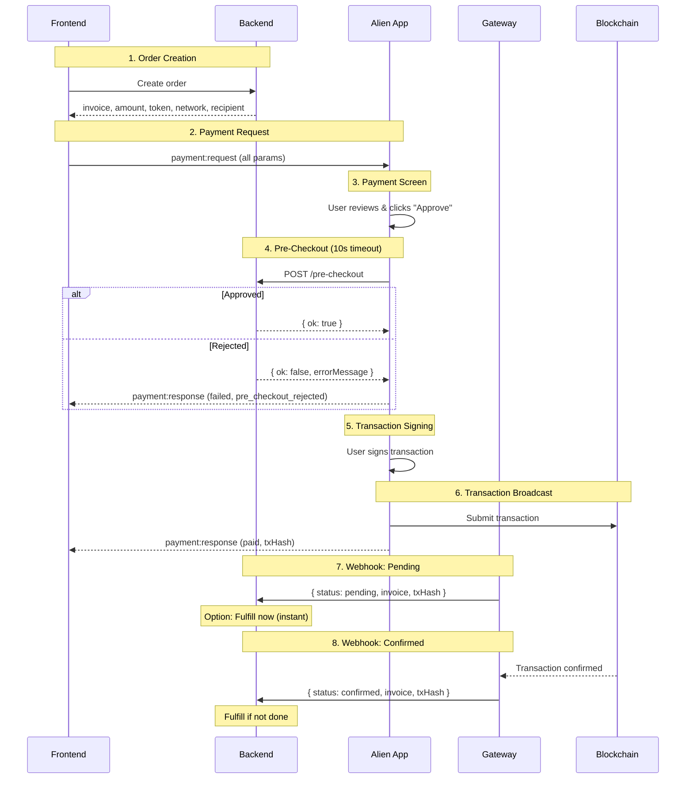

# Payments

Accept payments in your Mini App using the Alien payment system. The flow includes pre-checkout validation while keeping frontend control over payment params (like MetaMask).

## Payment Flow



## Frontend Integration

### Basic Payment Request

```tsx
import { usePayment } from '@alien_org/react';

function BuyButton({ orderId }: { orderId: string }) {
  const { pay, isLoading, isPaid, isFailed, txHash, errorCode } = usePayment({
    onPaid: (txHash) => console.log('Payment successful:', txHash),
    onCancelled: () => console.log('User cancelled'),
    onFailed: (code) => console.log('Failed:', code),
  });

  const handleBuy = () => pay({
    recipient: '0x1234...',       // Your wallet address
    amount: '1000000',            // Amount in smallest unit
    token: 'SOL',                 // Token identifier
    network: 'solana',            // 'solana' or 'alien'
    invoice: orderId,             // Your order/invoice ID

    // Optional display fields
    title: 'Premium Subscription',
    caption: '1 month of premium features',
    iconUrl: 'https://yourapp.com/icon.png',
  });

  if (isPaid) return <div>Thank you! TX: {txHash}</div>;
  if (isFailed) return <div>Payment failed: {errorCode}</div>;

  return (
    <button onClick={handleBuy} disabled={isLoading}>
      {isLoading ? 'Processing...' : 'Buy Now'}
    </button>
  );
}
```

### Request Fields

| Field | Type | Required | Description |
| ----- | ---- | -------- | ----------- |
| `recipient` | `string` | Yes | Wallet address to receive payment |
| `amount` | `string` | Yes | Amount in token's smallest unit |
| `token` | `string` | Yes | Token identifier (e.g., 'SOL', 'ALIEN') |
| `network` | `string` | Yes | Network: 'solana' or 'alien' |
| `invoice` | `string` | Yes | Your order/invoice ID |
| `title` | `string` | No | Item title for approval screen |
| `caption` | `string` | No | Item description for approval screen |
| `iconUrl` | `string` | No | Item icon URL for approval screen |
| `test` | `boolean` | No | Test mode (no real payment) |

### Error Codes

| Code | Meaning |
| ---- | ------- |
| `insufficient_balance` | User doesn't have enough tokens |
| `network_error` | Blockchain network issue |
| `pre_checkout_rejected` | Backend rejected in pre-checkout |
| `pre_checkout_timeout` | Backend didn't respond in 10s |
| `unknown` | Unexpected error |

## Backend Integration

### Pre-Checkout Endpoint

After the user clicks "Approve" but before signing, the Alien App calls your pre-checkout endpoint to validate the payment. You have 10 seconds to respond.

Configure the endpoint in your [manifest.json](./manifest.md#payments-configuration).

**Request:**
```typescript
POST {preCheckoutUrl}
Content-Type: application/json

{
  invoice: string,    // Invoice ID from payment:request
  amount: string,     // Amount from payment:request
  token: string,      // Token from payment:request
  network: string,    // Network from payment:request
  recipient: string,  // Recipient from payment:request
  test: boolean       // Test mode flag
}
```

**Approve:**
```typescript
{ ok: true }
```

**Reject:**
```typescript
{
  ok: false,
  errorMessage: "Order has expired"  // Shown to user
}
```

**What to validate:**
- Invoice exists and belongs to this user
- Invoice not expired
- Invoice not already paid
- Amount matches expected order amount
- Token/network are acceptable

### Webhook Handler

Your backend receives webhooks when transaction status changes:

| Status | Meaning | Action |
| ------ | ------- | ------ |
| `pending` | Transaction broadcast | Optionally fulfill (instant delivery) |
| `confirmed` | Transaction confirmed on-chain | Fulfill if not done on pending |
| `failed` | Transaction failed after broadcast | Reverse if fulfilled on pending |

Configure the endpoint in your [manifest.json](./manifest.md#payments-configuration).

```typescript
app.post('/webhooks/payment', async (req, res) => {
  const { invoice, status, txHash, amount, token, network, test } = req.body;

  if (test) {
    return res.json({ success: true });
  }

  const order = await Order.findByInvoice(invoice);
  if (!order) return res.status(404).json({ error: 'Order not found' });

  switch (status) {
    case 'pending':
      // Option A: Instant fulfillment (digital goods)
      await order.update({ status: 'pending', txHash });
      await order.fulfill();
      break;
      // Option B: Wait for confirmation (high-value items)
      // await order.update({ status: 'pending', txHash });

    case 'confirmed':
      await order.update({ status: 'confirmed' });
      if (!order.fulfilled) await order.fulfill();
      break;

    case 'failed':
      await order.update({ status: 'failed' });
      if (order.fulfilled) await order.reverse();
      break;
  }

  res.json({ success: true });
});
```

### Webhook Payload

| Field | Type | Description |
| ----- | ---- | ----------- |
| `invoice` | `string` | Your order/invoice ID |
| `status` | `'pending' \| 'confirmed' \| 'failed'` | Transaction status |
| `txHash` | `string` | Transaction hash |
| `amount` | `string` | Amount paid |
| `token` | `string` | Token used |
| `network` | `string` | Network used |
| `test` | `boolean` | Test mode flag |

## Test Mode

Pass `test: true` in your payment request to simulate payments without real transactions:

- Approval screen shows "TEST" indicator
- No tokens are transferred
- Pre-checkout and webhooks are called with `test: true`

```tsx
const { pay } = usePayment();

await pay({
  recipient: '0x1234...',
  amount: '1000000',
  token: 'SOL',
  network: 'solana',
  invoice: 'order_123',
  test: true, // Enable test mode
});
```

## Best Practices

1. **Use pre-checkout** - Validate orders before user signs to prevent invalid payments
2. **Make webhooks idempotent** - Use `invoice` + `status` to prevent duplicate processing
3. **Store txHash** - Save for future reference and dispute resolution
4. **Choose fulfillment timing** - `pending` for instant delivery, `confirmed` for high-value items
