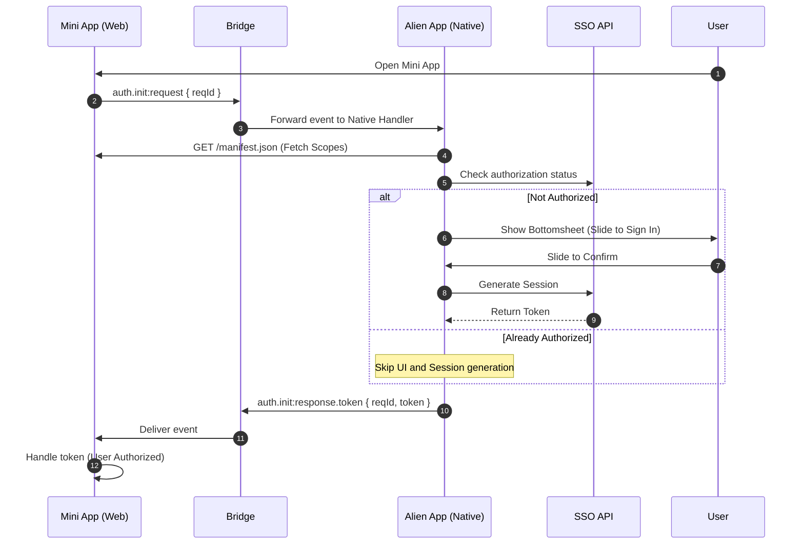

# Mini App Authentication Outline

## 1. Components

- **Alien App**: the native mobile application host.
- **Mini App**: a third-party web application running within the Alien App environment.
- **Alien SSO**: a decentralized service managing user sessions and permissions.

---

## 2. Authentication Flow

| Step  | Actor          | Action                                                                                                       |
| ----- | -------------- | ------------------------------------------------------------------------------------------------------------ |
| **1** | **User**       | Opens the Mini App within the Alien App.                                                                     |
| **2** | **Mini App**   | Calls bridge method `auth.init:request` with payload `{ reqId }` if user is not authenticated.               |
| **3** | **Bridge**     | Forwards the request to the Native App event handler.                                                        |
| **4** | **Native App** | Performs a `GET` request to `https://mini-app-url.com/manifest.json` to retrieve the OAuth 2.0 scopes.       |
| **5** | **Native App** | Checks local cache or queries the **SSO API** to verify if the user has already authorized this Mini App.    |
| **6** | **Native App** | _If unauthorized:_ Displays a bottomsheet with "Slide to Sign In" and requested scopes (e.g., avatar, name). |
| **7** | **Native App** | _Upon User Action:_ Requests the **SSO API** to generate a session/token.                                    |
| **8** | **Native App** | Sends `auth.init:response.token` event via the bridge with payload `{ reqId, token }`.                       |
| **9** | **Mini App**   | Awaits the `auth.init:response.token` event to complete authorization.                                       |

---

---

## 3. Technical Specifications

### Bridge Communication

- **Request Method**: `auth.init:request`
- **Response Method**: `auth.init:response.token`

### Manifest Requirements

The Mini App must host a `manifest.json` at its root URL containing the required scopes for the Native App to parse. More info on manifest here: [manifest.md](manifest.md).

> **Note**: If the user has previously authorized the application (Step 5), the Native App bypasses the UI interaction and proceeds directly to token delivery.
