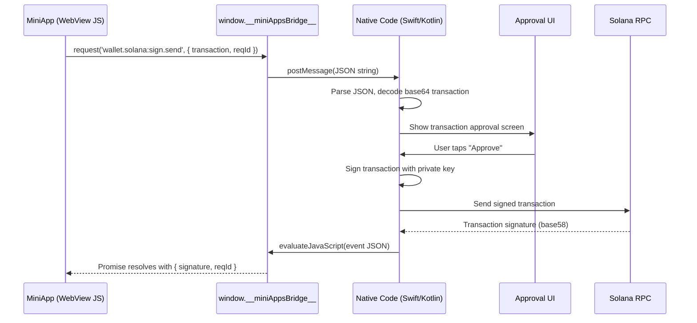
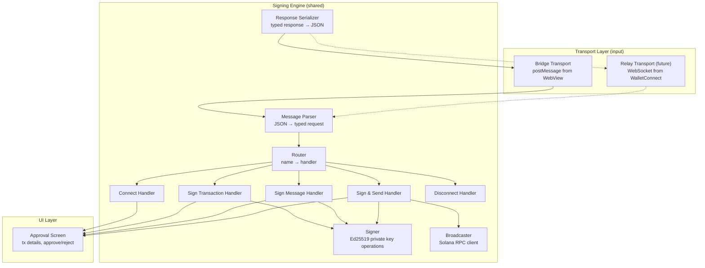

# Wallet Bridge Integration Guide

> **Audience:** iOS (Swift) and Android (Kotlin) mobile developers implementing wallet signing in the Alien app.
>
> **Scope:** Bridge mode — the miniapp runs inside the Alien app's WebView and communicates via `window.__miniAppsBridge__`.

---

## Table of Contents

1. [How It Works](#1-how-it-works)
2. [Message Format](#2-message-format)
3. [Wallet Methods & Events](#3-wallet-methods--events)
4. [Data Encoding Reference](#4-data-encoding-reference)
5. [Error Codes](#5-error-codes)
6. [Host App Requirements](#6-host-app-requirements)
7. [Signing Engine Architecture](#7-signing-engine-architecture)
8. [Approval UI Requirements](#8-approval-ui-requirements)
9. [Testing](#9-testing)
10. [Checklist](#10-checklist)

---

## 1. How It Works

The miniapp (a web page in a WebView) calls wallet operations through the Alien bridge. The bridge serializes the call as JSON and sends it to native code via `postMessage`. Native code processes the request (shows approval UI, signs with the private key, optionally broadcasts), then sends the result back to the WebView via JavaScript injection.



### Key Concepts

- **Method** = a request FROM the miniapp TO native code (e.g. "sign this transaction")
- **Event** = a response FROM native code TO the miniapp (e.g. "here's the signature")
- **`reqId`** = a UUID that links a request to its response. Always echo back the same `reqId` you received.
- **Fire-and-forget** = a method with no response event (e.g. `wallet.solana:disconnect`)

---

## 2. Message Format

### Incoming Messages (WebView → Native)

Every message arriving via `postMessage` is a JSON string with this shape:

```json
{
  "type": "method",
  "name": "wallet.solana:sign.transaction",
  "payload": {
    "reqId": "550e8400-e29b-41d4-a716-446655440000",
    "transaction": "AQAAAA...base64..."
  }
}
```

| Field | Type | Description |
|-------|------|-------------|
| `type` | `"method"` | Always `"method"` for incoming wallet requests |
| `name` | `string` | The method name (see section 3) |
| `payload` | `object` | Method-specific data. Contains `reqId` for request-response methods |

### Outgoing Messages (Native → WebView)

Send responses by injecting JavaScript that calls `window.postMessage()` on the WebView's `window`:

```json
{
  "type": "event",
  "name": "wallet.solana:sign.transaction.response",
  "payload": {
    "reqId": "550e8400-e29b-41d4-a716-446655440000",
    "signedTransaction": "AQAAAA...base64..."
  }
}
```

| Field | Type | Description |
|-------|------|-------------|
| `type` | `"event"` | Always `"event"` for outgoing responses |
| `name` | `string` | The response event name (see section 3) |
| `payload` | `object` | Response data. Must include the same `reqId` from the request |

### Sending Responses to the WebView

Serialize the response object to a JSON string and inject it via `evaluateJavaScript` (iOS) or `evaluateJavascript` (Android):

```javascript
window.postMessage({
  "type": "event",
  "name": "<event_name>",
  "payload": { ... }
});
```

---

## 3. Wallet Methods & Events

All wallet methods use the `wallet.solana:` prefix. Contract version: `1.0.0`.

### 3.1 Connect

Requests the wallet's public key. Show an approval screen if this is the first connection from this miniapp.

**Method:** `wallet.solana:connect`

```json
{
  "type": "method",
  "name": "wallet.solana:connect",
  "payload": {
    "reqId": "uuid-here"
  }
}
```

**Response event:** `wallet.solana:connect.response`

Success:

```json
{
  "type": "event",
  "name": "wallet.solana:connect.response",
  "payload": {
    "reqId": "uuid-here",
    "publicKey": "7xKXtg2CW87d97TXJSDpbD5jBkheTqA83TZRuJosgAsU"
  }
}
```

Error:

```json
{
  "type": "event",
  "name": "wallet.solana:connect.response",
  "payload": {
    "reqId": "uuid-here",
    "errorCode": 5000,
    "errorMessage": "User rejected"
  }
}
```

| Response Field | Type | Description |
|----------------|------|-------------|
| `reqId` | `string` | Echo from request |
| `publicKey` | `string?` | Base58-encoded Ed25519 public key (32 bytes). Present on success |
| `errorCode` | `number?` | Numeric error code. Present on error. See [section 5](#5-error-codes) |
| `errorMessage` | `string?` | Human-readable error description. Present on error |

---

### 3.2 Disconnect

Notifies the wallet to clear the connection state for this miniapp. **Fire-and-forget** — no response needed.

**Method:** `wallet.solana:disconnect`

```json
{
  "type": "method",
  "name": "wallet.solana:disconnect",
  "payload": {}
}
```

No response event. Just clear any stored session state for this miniapp.

---

### 3.3 Sign Transaction

Signs a transaction without broadcasting it. The miniapp will broadcast it itself.

**Method:** `wallet.solana:sign.transaction`

```json
{
  "type": "method",
  "name": "wallet.solana:sign.transaction",
  "payload": {
    "reqId": "uuid-here",
    "transaction": "AQAAAA...base64-encoded-serialized-transaction..."
  }
}
```

| Payload Field | Type | Description |
|---------------|------|-------------|
| `reqId` | `string` | Request ID |
| `transaction` | `string` | Base64-encoded serialized Solana transaction (legacy or versioned) |

**Response event:** `wallet.solana:sign.transaction.response`

```json
{
  "type": "event",
  "name": "wallet.solana:sign.transaction.response",
  "payload": {
    "reqId": "uuid-here",
    "signedTransaction": "AQAAAA...base64-encoded-signed-transaction..."
  }
}
```

| Response Field | Type | Description |
|----------------|------|-------------|
| `reqId` | `string` | Echo from request |
| `signedTransaction` | `string?` | Base64-encoded signed transaction. Present on success |
| `errorCode` | `number?` | Error code if signing failed |
| `errorMessage` | `string?` | Human-readable error description |

**Processing steps:**

1. Base64-decode `transaction` to get raw bytes
2. Deserialize the transaction (detect legacy vs versioned — see [section 4](#4-data-encoding-reference))
3. Show approval UI with transaction details
4. If approved: sign the transaction with the user's private key
5. Serialize the signed transaction back to bytes
6. Base64-encode and return as `signedTransaction`

---

### 3.4 Sign Message

Signs an arbitrary byte message with Ed25519. Used for authentication proofs ("Sign In With Solana"), off-chain signatures, etc.

**Method:** `wallet.solana:sign.message`

```json
{
  "type": "method",
  "name": "wallet.solana:sign.message",
  "payload": {
    "reqId": "uuid-here",
    "message": "StV1DL6CwTryKyV..."
  }
}
```

| Payload Field | Type | Description |
|---------------|------|-------------|
| `reqId` | `string` | Request ID |
| `message` | `string` | Base58-encoded message bytes |

**Response event:** `wallet.solana:sign.message.response`

```json
{
  "type": "event",
  "name": "wallet.solana:sign.message.response",
  "payload": {
    "reqId": "uuid-here",
    "signature": "3AsDY...base58-encoded-64-byte-signature...",
    "publicKey": "7xKXtg2CW87d97TXJSDpbD5jBkheTqA83TZRuJosgAsU"
  }
}
```

| Response Field | Type | Description |
|----------------|------|-------------|
| `reqId` | `string` | Echo from request |
| `signature` | `string?` | Base58-encoded Ed25519 signature (exactly 64 bytes) |
| `publicKey` | `string?` | Base58-encoded public key that produced the signature |
| `errorCode` | `number?` | Error code if signing failed |
| `errorMessage` | `string?` | Human-readable error description |

**Processing steps:**

1. Base58-decode `message` to get raw bytes
2. Show approval UI with message content (try UTF-8 decode for display, fall back to hex)
3. Sign the raw bytes with Ed25519 using the user's private key (sign the bytes directly, NOT a hash)
4. Return the 64-byte signature as base58 and the public key as base58

---

### 3.5 Sign and Send Transaction

Signs a transaction AND broadcasts it to the Solana network. The most common operation — used by `sendTransaction()` in wallet-adapter.

**Method:** `wallet.solana:sign.send`

```json
{
  "type": "method",
  "name": "wallet.solana:sign.send",
  "payload": {
    "reqId": "uuid-here",
    "transaction": "AQAAAA...base64...",
    "chain": "solana:mainnet",
    "options": {
      "skipPreflight": false,
      "preflightCommitment": "confirmed",
      "commitment": "confirmed",
      "minContextSlot": 12345678,
      "maxRetries": 3
    }
  }
}
```

| Payload Field | Type | Required | Description |
|---------------|------|----------|-------------|
| `reqId` | `string` | Yes | Request ID |
| `transaction` | `string` | Yes | Base64-encoded serialized transaction |
| `chain` | `string?` | No | Target cluster: `"solana:mainnet"`, `"solana:devnet"`, or `"solana:testnet"`. Defaults to mainnet. In relay mode, CAIP-2 chain IDs are used instead (see note below). |
| `options` | `object?` | No | Send options (all fields optional) |
| `options.skipPreflight` | `boolean?` | No | Skip transaction simulation before sending. Default: `false` |
| `options.preflightCommitment` | `string?` | No | Commitment for preflight: `"processed"`, `"confirmed"`, or `"finalized"` |
| `options.commitment` | `string?` | No | Desired commitment level for confirmation |
| `options.minContextSlot` | `number?` | No | Minimum slot the RPC node should have processed |
| `options.maxRetries` | `number?` | No | Maximum send retries by the RPC node |

**Response event:** `wallet.solana:sign.send.response`

```json
{
  "type": "event",
  "name": "wallet.solana:sign.send.response",
  "payload": {
    "reqId": "uuid-here",
    "signature": "5UfDuX...base58-transaction-signature..."
  }
}
```

| Response Field | Type | Description |
|----------------|------|-------------|
| `reqId` | `string` | Echo from request |
| `signature` | `string?` | **Base58-encoded** transaction signature (the tx ID). Present on success |
| `errorCode` | `number?` | Error code if signing or sending failed |
| `errorMessage` | `string?` | Human-readable error description |

**Processing steps:**

1. Base64-decode `transaction` to get raw bytes
2. Deserialize and show approval UI with transaction details
3. If approved: sign with private key
4. Determine the RPC endpoint from `chain` (or miniapp config if `chain` is absent)
5. Send to Solana RPC with the provided `options` (pass them through to `sendTransaction`)
6. Return the transaction signature as **base58** (this is the standard Solana tx ID format)

> **Note on chain IDs:** In bridge mode, `chain` uses wallet-standard format (`solana:mainnet`, `solana:devnet`). In relay mode, WalletConnect uses CAIP-2 format (`solana:5eykt4UsFv8P8NJdTREpY1vzqKqZKvdp`). Your RPC endpoint resolver should handle both formats. See the relay integration guide for the full CAIP-2 chain ID mapping.

---

## 4. Data Encoding Reference

### Encoding Summary

| Data | Encoding | Example |
|------|----------|---------|
| Transactions (request & response) | **Base64** | `"AQAAAA..."` |
| Public keys | **Base58** | `"7xKXtg2CW87d97TXJSDpbD5jBkheTqA83TZRuJosgAsU"` |
| Messages (sign message request) | **Base58** | `"SGVsbG8gV29ybGQ"` |
| Message signatures (sign message response) | **Base58** | `"3AsDY..."` (64 bytes) |
| Transaction signatures (sign-and-send response) | **Base58** | `"5UfDuX..."` (64 bytes) |

### Why Different Encodings?

- **Base64 for transactions** — compact encoding for large binary blobs (serialized transactions)
- **Base58 for everything else** (public keys, messages, signatures) — matches WalletConnect's Solana RPC spec and the Solana ecosystem standard

This encoding scheme is **identical to WalletConnect's Solana RPC**. The signing engine uses the same encoding regardless of transport (bridge or relay).

### Detecting Transaction Version

When you base64-decode a transaction, check the first byte to determine the format:

```
First byte & 0x80 == 0x80  →  Versioned transaction (v0)
First byte & 0x80 == 0x00  →  Legacy transaction
```

Versioned transactions (v0) are the modern Solana format. Use the [Reown WalletKit SDK](https://docs.reown.com/walletkit/overview) for transaction deserialization — it handles both legacy and versioned formats and will also be used for relay mode later:

- **iOS:** [WalletKit iOS Installation](https://docs.walletconnect.network/wallet-sdk/ios/installation)
- **Android:** [WalletKit Android Installation](https://docs.walletconnect.network/wallet-sdk/android/installation)

---

## 5. Error Codes

When an operation fails, respond with `errorCode` + `errorMessage` instead of the success fields. These are **WalletConnect-compatible numeric codes** — the same codes are used in both bridge and relay mode.

| Code | Constant | `errorMessage` example | When to Use |
|------|----------|------------------------|-------------|
| `5000` | `USER_REJECTED` | `"User rejected"` | User tapped "Reject" / "Cancel" on the approval screen |
| `-32602` | `INVALID_PARAMS` | `"Invalid transaction"` | Transaction bytes could not be deserialized (malformed base64, invalid structure) |
| `-32603` | `INTERNAL_ERROR` | `"Transaction send failed"` | Transaction broadcast failed, unexpected error, wallet not connected |
| `8000` | `REQUEST_EXPIRED` | `"Request timed out"` | Request expired before the user responded |

### Error Response Example

```json
{
  "type": "event",
  "name": "wallet.solana:sign.send.response",
  "payload": {
    "reqId": "uuid-here",
    "errorCode": 5000,
    "errorMessage": "User rejected"
  }
}
```

### Rules

- Always include both `errorCode` (number) and `errorMessage` (string) in error responses
- Never include success fields (`signedTransaction`, `signature`, `publicKey`) alongside error fields
- The `errorMessage` is for developer debugging — write clear, descriptive messages

---

## 6. Host App Requirements

For wallet bridge mode to work, the host app must inject these into the WebView before the miniapp loads.

### 6.1 The Bridge Object

```javascript
window.__miniAppsBridge__ = {
  postMessage: function(data) {
    // `data` is a JSON string
    // Forward to native code
  }
};
```

This is the existing bridge — no changes needed if you already support other methods like `payment:request`.

### 6.2 Auth Token and Contract Version (existing)

```javascript
window.__ALIEN_AUTH_TOKEN__ = "jwt-token-here";
window.__ALIEN_CONTRACT_VERSION__ = "1.0.0";  // bump to 1.0.0 for wallet support
```

The contract version tells the miniapp SDK which methods are available. Setting it to `1.0.0` or higher enables wallet methods.

### 6.3 Message Listener

Your native code must listen for `postMessage` calls from the WebView. This is the same listener used for all bridge methods. When you receive a message:

1. Parse the JSON string
2. Check `type === "method"`
3. Route by `name` to the appropriate wallet handler
4. Process and respond

---

## 7. Signing Engine Architecture

Build the signing engine as a **standalone module** that is not coupled to WebView or `postMessage`. This same engine will be reused for relay mode (WalletConnect) — only the transport layer changes.

### Architecture Diagram



### Recommended Module Structure

```
WalletSigningEngine/
├── MessageParser          # JSON → typed request union
├── WalletRouter           # Routes by method name to handler
├── Handlers/
│   ├── ConnectHandler     # Returns public key
│   ├── SignTransactionHandler   # Sign, return signed tx bytes
│   ├── SignMessageHandler       # Sign raw bytes with Ed25519
│   ├── SignAndSendHandler       # Sign + broadcast via RPC
│   └── DisconnectHandler        # Clear session state
├── Signer                 # Ed25519 signing with private key
├── SolanaRpcClient        # sendTransaction to Solana RPC
├── ResponseSerializer     # Typed response → JSON string
└── ApprovalUI             # Shared approval screen
```

### Key Design Rules

1. **The engine accepts a typed request and returns a typed response.** It does not know about WebViews, WebSockets, or postMessage.
2. **Transport adapters** convert between wire format (JSON string from `postMessage` or WebSocket frame) and the engine's typed requests/responses.
3. **One signing engine, multiple transports.** When relay mode ships, you add a `RelayTransportAdapter` that feeds the same engine.
4. **RPC endpoint resolution handles both chain ID formats.** Bridge uses wallet-standard format (`solana:mainnet`), relay uses CAIP-2 (`solana:5eykt4UsFv8P8NJdTREpY1vzqKqZKvdp`). Build one resolver function that handles both.

---

## 8. Approval UI Requirements

### 8.1 Connection Approval

For now, `wallet.solana:connect` can auto-approve in bridge mode — the user already chose to open the miniapp, so return the public key immediately.

However, build the connection approval screen anyway. Future scenarios (e.g. per-miniapp permission scoping, connecting additional chains) may require explicit user consent. The screen should show:

- Miniapp name and icon
- Which wallet/account will be connected
- "Connect" / "Cancel" buttons

### 8.2 Transaction Approval

Must show:
- Which miniapp is requesting
- Transaction summary (parse instructions if possible, show raw data as fallback)
- Estimated network fee
- Approve / Reject buttons

### 8.3 Message Signing Approval

Must show:
- Which miniapp is requesting
- Message content (UTF-8 decoded if valid, hex otherwise)
- Sign / Reject buttons

### 8.4 Timeout Behavior

The JS SDK sets a 60-second timeout for wallet operations. If the user doesn't respond within 60 seconds, the miniapp will receive a timeout error. Your UI should:
- Not auto-dismiss (let the timeout happen on the JS side)
- Dismiss the approval screen if the WebView is closed

---

## 9. Testing

### 9.1 Test with the Example Miniapp

The repo includes a test miniapp at `examples/solana-wallet/` that exercises all wallet operations.

```bash
cd examples/solana-wallet
bun install
bun dev
```

Load the dev server URL in your WebView to test.

### 9.2 Manual Test Cases

| # | Test | Expected Result |
|---|------|-----------------|
| 1 | Connect | Public key returned, miniapp shows address |
| 2 | Connect when already connected | Returns same public key immediately (no UI) |
| 3 | Connect → Reject | `errorCode: 5000` |
| 4 | Sign transaction (legacy) | Signed transaction returned, base64 |
| 5 | Sign transaction (versioned v0) | Signed transaction returned, base64 |
| 6 | Sign transaction → Reject | `errorCode: 5000` |
| 7 | Sign transaction with malformed base64 | `errorCode: -32602` |
| 8 | Sign message (UTF-8 text) | Signature (base58, 64 bytes) + publicKey (base58) |
| 9 | Sign message (binary) | Same — display as hex |
| 10 | Sign and send (devnet) | Transaction signature returned (base58), visible on explorer |
| 11 | Sign and send → RPC failure | `errorCode: -32603` |
| 12 | Sign and send with options | Options forwarded to RPC correctly |
| 13 | Disconnect | Session cleared, subsequent sign calls would need reconnect |
| 14 | `reqId` correlation | Each response carries the exact `reqId` from its request |

### 9.3 Verifying Signatures

For sign-and-send, verify on Solana Explorer:
- Devnet: `https://explorer.solana.com/tx/<signature>?cluster=devnet`

For sign message, verify Ed25519:
```
publicKey: base58 → 32 bytes
message: base58 → raw bytes
signature: base58 → 64 bytes
Ed25519.verify(signature, message, publicKey) → true
```

---

## 10. Checklist

### Bridge Infrastructure
- [ ] `window.__miniAppsBridge__.postMessage` sends JSON to native code
- [ ] `window.__ALIEN_CONTRACT_VERSION__` set to `"1.0.0"` or higher
- [ ] Native code listens for `postMessage` from WebView
- [ ] Native code can inject JavaScript back to WebView (`evaluateJavaScript`)

### Message Handling
- [ ] Parse incoming JSON with `type`, `name`, `payload` fields
- [ ] Route `wallet.solana:*` methods to wallet handlers
- [ ] Echo `reqId` in every response
- [ ] Send responses as `{ type: "event", name: "...", payload: {...} }`

### Wallet Operations
- [ ] `wallet.solana:connect` — returns base58 public key
- [ ] `wallet.solana:disconnect` — clears session (no response)
- [ ] `wallet.solana:sign.transaction` — signs, returns base64 signed tx
- [ ] `wallet.solana:sign.message` — signs raw bytes, returns base58 signature + base58 public key
- [ ] `wallet.solana:sign.send` — signs, broadcasts, returns base58 tx signature

### Error Handling
- [ ] `5000` when user rejects
- [ ] `-32602` for malformed input
- [ ] `-32603` for broadcast failure or unexpected errors
- [ ] `8000` for request timeout
- [ ] Every error response includes both `errorCode` (number) and `errorMessage` (string)

### Approval UI
- [ ] Transaction approval screen with details and approve/reject
- [ ] Message signing screen with content display and sign/reject
- [ ] Both legacy and versioned transactions handled correctly

### Relay Readiness
- [ ] Signing engine is a standalone module (not coupled to WebView)
- [ ] Message parser accepts typed requests (not raw WebView events)
- [ ] RPC endpoint determined by `chain` field (not hardcoded)
