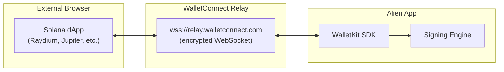
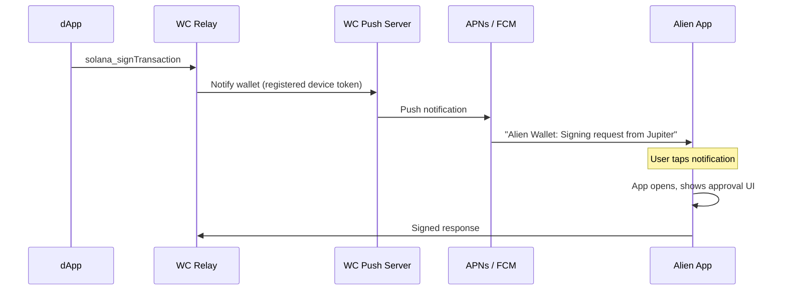

# Wallet Relay Integration Guide

> **Audience:** iOS (Swift) and Android (Kotlin) mobile developers adding WalletConnect relay support to the Alien app.
>
> **What this enables:** Users connect Alien Wallet to any Solana dApp (Raydium, Jupiter, Tensor, etc.) running in an external browser — by scanning a QR code or tapping a deep link.

---

## Table of Contents

1. [Overview](#1-overview)
2. [How It Differs from Bridge Mode](#2-how-it-differs-from-bridge-mode)
3. [WalletConnect Protocol Primer](#3-walletconnect-protocol-primer)
4. [WalletKit SDK Setup](#4-walletkit-sdk-setup)
5. [Pairing (QR Code & Deep Links)](#5-pairing-qr-code--deep-links)
6. [Session Proposals](#6-session-proposals)
7. [Session Requests (Signing)](#7-session-requests-signing)
8. [Session Management](#8-session-management)
9. [Data Encoding & Chain IDs](#9-data-encoding--chain-ids)
10. [Error Codes](#10-error-codes)
11. [Deep Link Configuration](#11-deep-link-configuration)
12. [Push Notifications](#12-push-notifications)
13. [UI Requirements](#13-ui-requirements)
14. [Testing](#14-testing)
15. [Checklist](#15-checklist)

---

## 1. Overview

In relay mode, the dApp runs in an external browser (not inside Alien). Communication goes through a **WalletConnect relay server** — an encrypted WebSocket connection between the dApp and the Alien app.



**What you build:**
1. Integrate the Reown WalletKit SDK (WalletConnect's wallet-side SDK)
2. Handle QR code scanning and deep links (pairing)
3. Handle session proposals (connection approval)
4. Handle session requests (signing operations)
5. UI screens for approval, active sessions, QR scanner

---

## 2. How It Differs from Bridge Mode

| | Bridge Mode | Relay Mode |
|---|---|---|
| **dApp location** | Inside Alien WebView | External browser (Chrome, Safari, desktop) |
| **Transport** | `postMessage` (local, instant) | WebSocket relay (network, ~100-300ms latency) |
| **Message format** | Custom JSON (`{ type, name, payload }`) | WalletConnect JSON-RPC 2.0 |
| **Connection** | Automatic (bridge injected) | Manual (QR scan or deep link) |
| **Sessions** | Implicit (WebView lifetime) | Explicit (persist across app restarts) |
| **Trust level** | High (miniapp vetted by Alien) | Lower (any dApp can request connection) |
| **Chain IDs** | Wallet-standard (`solana:mainnet`) | CAIP-2 (`solana:5eykt4UsFv8P8NJdTREpY1vzqKqZKvdp`) |

### What stays the same

- **Signing logic** — Ed25519 signing, transaction deserialization, Solana RPC broadcasting
- **Data encoding** — Same encoding for all fields (base64 for transactions, base58 for messages/signatures/keys)
- **Approval UI** — Same screens (only the "requesting app" label changes: miniapp name vs dApp URL)
- **Error codes** — Same numeric codes (`5000`, `-32602`, `-32603`, `8000`)

---

## 3. WalletConnect Protocol Primer

WalletConnect v2 uses these concepts:

### Pairing

A one-time handshake that establishes an encrypted channel. Triggered by QR code or deep link containing a **pairing URI**:

```
wc:7f6e504b...@2?symKey=587d...&relay-protocol=irn
```

- `7f6e504b...` = topic (identifies the pairing)
- `@2` = WalletConnect protocol version 2
- `symKey` = symmetric encryption key
- `relay-protocol=irn` = relay protocol (always `irn`)

### Session

After pairing, the dApp proposes a **session** specifying which chains and methods it wants access to. The wallet approves or rejects. Once approved, the session persists and the dApp can send signing requests.

### Namespaces

Sessions are scoped by **namespaces**. For Solana:

```json
{
  "solana": {
    "chains": ["solana:5eykt4UsFv8P8NJdTREpY1vzqKqZKvdp"],
    "methods": [
      "solana_signTransaction",
      "solana_signMessage",
      "solana_signAndSendTransaction"
    ],
    "events": [],
    "accounts": [
      "solana:5eykt4UsFv8P8NJdTREpY1vzqKqZKvdp:7xKXtg2CW87d97TXJSDpbD5jBkheTqA83TZRuJosgAsU"
    ]
  }
}
```

Account format: `<chain_id>:<public_key_base58>`

---

## 4. WalletKit SDK Setup

### 4.1 Get a Project ID

Register at [cloud.reown.com](https://cloud.reown.com) to get a free Project ID. This identifies the Alien app on the WalletConnect network.

### 4.2 Install the SDK

- **iOS:** [WalletKit iOS Installation](https://docs.walletconnect.network/wallet-sdk/ios/installation)
- **Android:** [WalletKit Android Installation](https://docs.walletconnect.network/wallet-sdk/android/installation)

### 4.3 Initialize

Configure WalletKit with Alien's metadata during app startup:

| Field | Value |
|-------|-------|
| `name` | `"Alien Wallet"` |
| `description` | `"Alien Wallet for Solana"` |
| `url` | `"https://alien.app"` |
| `icons` | `["https://alien.app/icon.png"]` |
| `redirect.native` | `"alien://"` |
| `redirect.universal` | `"https://alien.app/ul"` |

Pass your Project ID during networking/core configuration.

---

## 5. Pairing (QR Code & Deep Links)

### 5.1 QR Code Scanning

When the user scans a QR code:

1. Validate the scanned string starts with `wc:`
2. Call the WalletKit `pair(uri:)` method with the full URI
3. This triggers a session proposal event (handled in section 6)

### 5.2 Deep Links

When the app receives a deep link, extract the WalletConnect URI and pair:

| Link format | Example |
|-------------|---------|
| Custom scheme | `alien://wc?uri=wc%3A7f6e504b...` |
| Universal link | `https://alien.app/ul/wc?uri=wc%3A7f6e504b...` |

**Steps:**
1. Detect the scheme (`alien://wc` or `https://alien.app/ul/wc`)
2. Extract the `uri` query parameter
3. URL-decode it
4. Call the same pairing function used for QR codes

---

## 6. Session Proposals

After pairing, the dApp sends a **session proposal** specifying which chains and methods it needs.

### 6.1 Listening

Subscribe to the WalletKit session proposal event/publisher. When a proposal arrives, show the approval screen.

### 6.2 Approving

When the user approves, respond with the Solana namespaces:

| Namespace field | Value |
|-----------------|-------|
| `chains` | `["solana:5eykt4UsFv8P8NJdTREpY1vzqKqZKvdp", "solana:EtWTRABZaYq6iMfeYKouRu166VU2xqa1"]` |
| `accounts` | `["solana:5eykt4UsFv8P8NJdTREpY1vzqKqZKvdp:<publicKey>", "solana:EtWTRABZaYq6iMfeYKouRu166VU2xqa1:<publicKey>"]` |
| `methods` | `["solana_signTransaction", "solana_signMessage", "solana_signAndSendTransaction"]` |
| `events` | `[]` |

Replace `<publicKey>` with the wallet's base58-encoded public key.

### 6.3 Rejecting

Call WalletKit's reject method with the proposal ID and a user-rejected reason.

---

## 7. Session Requests (Signing)

Once a session is approved, the dApp sends signing requests as **session requests** with a JSON-RPC method name and params.

### 7.1 Listening

Subscribe to the WalletKit session request event/publisher. Each request contains:
- `method` — the JSON-RPC method name
- `params` — the request parameters (JSON object)
- `chainId` — the CAIP-2 chain ID from the session
- `topic` — the session topic (for routing the response)
- `id` — the request ID (echo in the response)

### 7.2 Supported Methods

#### `solana_signTransaction`

**Params:**

```json
{
  "transaction": "AQAAAA...base64-encoded-transaction..."
}
```

**Success response:**

The WC spec supports two response formats. Prefer the newer `transaction` field:

```json
{
  "transaction": "AQAAAA...base64-encoded-signed-transaction..."
}
```

Legacy format (also accepted by dApps):

```json
{
  "signature": "5UfDuX...base58-encoded-signature..."
}
```

**Processing:** Base64-decode → deserialize → show approval → sign → serialize signed tx → base64-encode → respond with `transaction` field.

---

#### `solana_signMessage`

**Params:**

```json
{
  "message": "base58-encoded-message-bytes",
  "pubkey": "7xKXtg2CW87d97TXJSDpbD5jBkheTqA83TZRuJosgAsU"
}
```

> The message is **base58-encoded** — same encoding as bridge mode.

**Success response:**

```json
{
  "signature": "base58-encoded-signature"
}
```

**Processing:** Base58-decode message → show approval → Ed25519 sign raw bytes (NOT hashed) → base58-encode signature → respond.

---

#### `solana_signAndSendTransaction`

**Params:**

```json
{
  "transaction": "AQAAAA...base64-encoded-transaction...",
  "sendOptions": {
    "skipPreflight": false,
    "preflightCommitment": "confirmed",
    "commitment": "confirmed",
    "minContextSlot": 12345678,
    "maxRetries": 3
  }
}
```

Note: `sendOptions` field name differs from bridge mode's `options`.

**Success response:**

```json
{
  "signature": "5UfDuX...base58-transaction-signature..."
}
```

**Processing:** Base64-decode transaction → deserialize → show approval → sign → determine RPC from session's chain ID → broadcast → return base58 tx signature.

### 7.3 Responding

- **Success:** Respond via WalletKit with a JSON-RPC result containing the success payload
- **Error:** Respond via WalletKit with a JSON-RPC error containing `code` (number) and `message` (string). See [section 10](#10-error-codes).
- **Unknown method:** Respond with error code `-32601` ("Method not found")

---

## 8. Session Management

### 8.1 Active Sessions

WalletKit persists sessions across app restarts. Query active sessions to show the user which dApps are connected. Each session contains peer metadata: `name`, `url`, `icons[]`, `description`.

### 8.2 Disconnecting

**User-initiated (from Alien):** Call WalletKit's disconnect method with the session topic.

**dApp-initiated:** Subscribe to the session delete event/publisher. Remove the session from your UI when it fires.

---

## 9. Data Encoding & Chain IDs

### Encoding Summary

| Data | Encoding |
|------|----------|
| Transactions (request & response) | **Base64** |
| Message bytes (`solana_signMessage`) | **Base58** |
| Message signature (`solana_signMessage` response) | **Base58** |
| Public keys | **Base58** |
| Transaction signatures (`solana_signAndSendTransaction` response) | **Base58** |

### Encoding Consistency

The bridge and relay use **identical encoding** for all fields. No conversion is needed between transports — the signing engine handles the same encoding regardless of whether the request came from a WebView bridge or WalletConnect relay.

### CAIP-2 Chain IDs

WalletConnect uses CAIP-2 identifiers (the first 32 chars of the base58-encoded genesis hash):

| Network | CAIP-2 Chain ID | Wallet-Standard (bridge) |
|---------|----------------|--------------------------|
| Mainnet | `solana:5eykt4UsFv8P8NJdTREpY1vzqKqZKvdp` | `solana:mainnet` |
| Devnet | `solana:EtWTRABZaYq6iMfeYKouRu166VU2xqa1` | `solana:devnet` |
| Testnet | `solana:4uhcVJyU9pJkvQyS88uRDiswHXSCkY3z` | `solana:testnet` |

Your RPC endpoint resolver should handle both formats (from bridge and relay).

### Detecting Transaction Version

When you base64-decode a transaction, check the first byte:

```
First byte & 0x80 == 0x80  →  Versioned transaction (v0)
First byte & 0x80 == 0x00  →  Legacy transaction
```

---

## 10. Error Codes

When responding to session requests with an error, use these WalletConnect-compatible codes:

| Code | Message | When to Use |
|------|---------|-------------|
| `5000` | `"User rejected"` | User declined signing or wallet not connected |
| `-32602` | `"Invalid params"` | Transaction deserialization failed, malformed input |
| `-32603` | `"Internal error"` | Transaction broadcast failed, unexpected error |
| `8000` | `"Session request expired"` | Request expired before user responded |
| `-32601` | `"Method not found"` | Unknown JSON-RPC method |

### Session-level Error Codes (namespace negotiation)

These codes are used only when rejecting session proposals, NOT for signing errors:

| Code | Message | When to Use |
|------|---------|-------------|
| `5001` | `"User rejected chains"` | Requested chains not supported |
| `5002` | `"User rejected methods"` | Requested methods not supported |

> **Note:** Codes `5100`-`5104` are reserved for CAIP-25 namespace errors — do NOT use them for signing operation errors.

### Consistency with Bridge Mode

These are the same error codes used in bridge mode. If you built a shared signing engine, the `errorCode` and `errorMessage` it produces can be forwarded directly as WalletConnect JSON-RPC error `{ code, message }` — no mapping needed.

---

## 11. Deep Link Configuration

### 11.1 URL Schemes

| Scheme | Example | Purpose |
|--------|---------|---------|
| `alien://wc` | `alien://wc?uri=wc%3A...` | Same-device pairing (dApp opens Alien) |
| `https://alien.app/ul/wc` | `https://alien.app/ul/wc?uri=wc%3A...` | Universal link pairing |

### 11.2 iOS Configuration

**Info.plist — custom scheme:**

```xml
<key>CFBundleURLTypes</key>
<array>
    <dict>
        <key>CFBundleURLSchemes</key>
        <array>
            <string>alien</string>
        </array>
    </dict>
</array>
```

**Entitlements — associated domains:**

```
applinks:alien.app
```

**Server-side — `https://alien.app/.well-known/apple-app-site-association`:**

```json
{
  "applinks": {
    "apps": [],
    "details": [
      {
        "appID": "TEAM_ID.com.alien.wallet",
        "paths": ["/ul/*"]
      }
    ]
  }
}
```

### 11.3 Android Configuration

**AndroidManifest.xml:**

```xml
<!-- Custom scheme -->
<intent-filter>
    <action android:name="android.intent.action.VIEW" />
    <category android:name="android.intent.category.DEFAULT" />
    <category android:name="android.intent.category.BROWSABLE" />
    <data android:scheme="alien" android:host="wc" />
</intent-filter>

<!-- Universal links -->
<intent-filter android:autoVerify="true">
    <action android:name="android.intent.action.VIEW" />
    <category android:name="android.intent.category.DEFAULT" />
    <category android:name="android.intent.category.BROWSABLE" />
    <data android:scheme="https" android:host="alien.app" android:pathPrefix="/ul/" />
</intent-filter>
```

**Server-side — `https://alien.app/.well-known/assetlinks.json`:**

```json
[{
  "relation": ["delegate_permission/common.handle_all_urls"],
  "target": {
    "namespace": "android_app",
    "package_name": "com.alien.wallet",
    "sha256_cert_fingerprints": ["YOUR_CERT_FINGERPRINT"]
  }
}]
```

---

## 12. Push Notifications

Without push notifications, signing requests only work when the Alien app is in the foreground. With push, the user gets a notification when a dApp requests signing.



### Setup

Register your device token (APNs on iOS, FCM on Android) with WalletKit using its `registerDeviceToken` method. See the WalletKit SDK docs for platform-specific instructions.

> Push notifications are optional for v1. Without them, the user must have the Alien app open. Implement in a follow-up iteration.

---

## 13. UI Requirements

### 13.1 QR Scanner Screen

**Entry point:** Accessible from wallet home screen (e.g. scan icon in the top bar).

**Behavior:**
- Camera permission request
- Scan QR → validate it starts with `wc:` → call `pair(uri:)`
- Show loading state while pairing
- Error state if QR is invalid

### 13.2 Session Proposal Screen

Shown when `onSessionProposal` fires. Must display:
- dApp icon, name, and URL (from `proposal.params.proposer.metadata`)
- Requested chains (e.g. "Solana Mainnet")
- Requested permissions (sign transactions, sign messages, send transactions)
- "Connect" / "Reject" buttons

### 13.3 Transaction Approval Screen

Must show:
- dApp name and URL (from session metadata)
- Which network the transaction targets (from session chain ID)
- Transaction summary (parse instructions if possible, raw data as fallback)
- Estimated network fee
- "Approve" / "Reject" buttons

### 13.4 Message Signing Screen

Must show:
- dApp name and URL
- Message content (UTF-8 decoded if valid, hex otherwise)
- "Sign" / "Reject" buttons

### 13.5 Active Sessions Screen

List all connected dApps with:
- dApp icon, name, URL
- Connection time
- "Disconnect" button per session

Data source: `WalletKit.getSessions()` — each session has `peer.name`, `peer.url`, `peer.icons`.

---

## 14. Testing

### 14.1 Test dApps

| dApp | URL | Purpose |
|------|-----|---------|
| WalletConnect Test dApp | [react-app.walletconnect.com](https://react-app.walletconnect.com) | Basic WC protocol testing |
| Reown AppKit Example | `examples/reown-appkit/` (in this repo) | Full Solana dApp with WC |
| Jupiter | [jup.ag](https://jup.ag) | Real production dApp (mainnet) |
| Raydium | [raydium.io](https://raydium.io) | Real production dApp (mainnet) |

### 14.2 Test Flow

```
1. Open test dApp in desktop browser
2. Click "Connect Wallet" → select WalletConnect
3. QR code appears
4. Open Alien app → scan QR
5. Session proposal screen → Approve
6. dApp shows connected wallet address
7. Perform swap/action → signing request appears in Alien
8. Approve → transaction sent
9. Disconnect from Alien → dApp shows disconnected
```

### 14.3 Manual Test Cases

| # | Test | Expected |
|---|------|----------|
| 1 | Scan valid QR | Session proposal screen appears |
| 2 | Scan invalid QR (not `wc:`) | Error/ignored |
| 3 | Open `alien://wc?uri=...` deep link | Session proposal screen appears |
| 4 | Open `https://alien.app/ul/wc?uri=...` universal link | Session proposal screen appears |
| 5 | Approve session | dApp shows connected, address matches |
| 6 | Reject session | dApp shows "user rejected" error |
| 7 | `solana_signTransaction` | Signed tx returned to dApp |
| 8 | `solana_signMessage` | Signature returned (base58 message decoded correctly) |
| 9 | `solana_signAndSendTransaction` | Tx broadcast, signature returned |
| 10 | Reject a signing request | dApp gets error code `5000` |
| 11 | Disconnect from Alien | dApp shows disconnected |
| 12 | dApp disconnects | Alien removes session from active list |
| 13 | Kill and reopen Alien | Active sessions still listed (persistence) |
| 14 | Same QR scanned twice | Second scan is no-op (already paired) |
| 15 | Multiple active sessions | Each session independent, correct dApp labels |

### 14.4 Using the Repo's Example dApps

```bash
# Relay mode testing with Reown AppKit
cd examples/reown-appkit
cp .env.example .env  # add your VITE_REOWN_PROJECT_ID
bun install && bun dev
# Opens at http://localhost:5173 — click Connect, scan QR with Alien
```

---

## 15. Checklist

### SDK Setup
- [ ] Reown Project ID obtained from [cloud.reown.com](https://cloud.reown.com)
- [ ] WalletKit SDK installed ([iOS](https://docs.walletconnect.network/wallet-sdk/ios/installation) / [Android](https://docs.walletconnect.network/wallet-sdk/android/installation))
- [ ] WalletKit initialized with Alien metadata and redirect URIs

### Pairing
- [ ] QR scanner screen implemented
- [ ] QR scan extracts `wc:` URI and calls `pair()`
- [ ] Deep link `alien://wc?uri=...` triggers pairing
- [ ] Universal link `https://alien.app/ul/wc?uri=...` triggers pairing

### Session Management
- [ ] Session proposal UI shows dApp metadata (name, icon, URL)
- [ ] Approve sends correct Solana namespaces (chains, methods, accounts)
- [ ] Reject sends user rejection
- [ ] Active sessions screen lists connected dApps
- [ ] User can disconnect individual sessions
- [ ] dApp-initiated disconnect handled
- [ ] Sessions persist across app restarts

### Signing
- [ ] `solana_signTransaction` — base64 transaction, returns `{ transaction: base64 }` (preferred) or `{ signature: base58 }` (legacy)
- [ ] `solana_signMessage` — base58 message decoded to bytes before signing
- [ ] `solana_signAndSendTransaction` — base64 transaction, returns base58 tx signature
- [ ] RPC endpoint determined from session's CAIP-2 chain ID
- [ ] Approval UI shows dApp name/URL (from session metadata)
- [ ] Responses use correct JSON-RPC result/error format

### Error Handling
- [ ] User rejection → error code `5000`
- [ ] Invalid transaction → error code `-32602`
- [ ] Send failure → error code `-32603`
- [ ] Timeout → error code `8000`
- [ ] Unknown method → error code `-32601`

### Deep Links (server-side)
- [ ] `apple-app-site-association` deployed at `https://alien.app/.well-known/`
- [ ] `assetlinks.json` deployed at `https://alien.app/.well-known/`

### Push Notifications (optional for v1)
- [ ] Device token registered with WalletKit
- [ ] Push notification opens app and shows approval UI

### Platform Config
- [ ] iOS: URL scheme `alien` registered in Info.plist
- [ ] iOS: Associated domain `applinks:alien.app` in entitlements
- [ ] Android: Intent filters for `alien://wc` in AndroidManifest.xml
- [ ] Android: Intent filters for `https://alien.app/ul/` with `autoVerify`

---

## Resources

| Resource | URL |
|----------|-----|
| Reown WalletKit Overview | [docs.reown.com/walletkit/overview](https://docs.reown.com/walletkit/overview) |
| WalletKit iOS Guide | [docs.reown.com/walletkit/ios/usage](https://docs.reown.com/walletkit/ios/usage) |
| WalletKit Android Guide | [docs.reown.com/walletkit/android/usage](https://docs.reown.com/walletkit/android/usage) |
| Solana RPC Reference | [docs.reown.com/advanced/multichain/rpc-reference/solana-rpc](https://docs.reown.com/advanced/multichain/rpc-reference/solana-rpc) |
| WC Pairing URI Spec | [specs.walletconnect.com/2.0/specs/clients/core/pairing/pairing-uri](https://specs.walletconnect.com/2.0/specs/clients/core/pairing/pairing-uri) |
| Reown Cloud (Project ID) | [cloud.reown.com](https://cloud.reown.com) |
