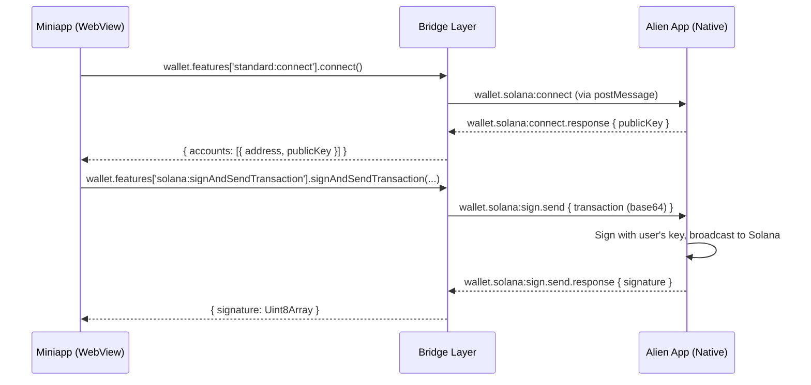

# @alien_org/solana-provider

Solana wallet provider for Alien miniapps. Implements the [Wallet Standard](https://github.com/wallet-standard/wallet-standard) so the Alien Wallet is auto-discovered by `@solana/wallet-adapter` — no manual adapter config needed.

> **Runs inside the Alien app WebView only.** The provider communicates with the host app's native wallet through the miniapp bridge (`window.__miniAppsBridge__`).

## Install

```bash
bun add @alien_org/solana-provider
```

If you use `@solana/wallet-adapter-react` (most common setup), you also need:

```bash
bun add @solana/wallet-adapter-react @solana/wallet-adapter-react-ui @solana/web3.js
```

## Quick Start

### 1. Register the wallet

Call `initAlienWallet()` once at your app's entry point, **before** rendering any wallet UI. This registers Alien Wallet with the wallet-standard registry so adapters can discover it.

```ts
// src/main.tsx
import { initAlienWallet } from '@alien_org/solana-provider';

initAlienWallet();
```

### 2. Set up providers (React)

Use the standard Solana wallet adapter providers. Pass an **empty array** to `wallets` — Alien Wallet is discovered automatically via wallet-standard.

```tsx
// src/App.tsx
import { ConnectionProvider, WalletProvider } from '@solana/wallet-adapter-react';
import { WalletModalProvider } from '@solana/wallet-adapter-react-ui';

const RPC_URL = 'https://api.mainnet-beta.solana.com';

function App() {
  return (
    <ConnectionProvider endpoint={RPC_URL}>
      <WalletProvider wallets={[]} autoConnect>
        <WalletModalProvider>
          <YourApp />
        </WalletModalProvider>
      </WalletProvider>
    </ConnectionProvider>
  );
}
```

### 3. Use the wallet

Use `useWallet()` as you normally would with any Solana wallet adapter:

```tsx
import { useWallet } from '@solana/wallet-adapter-react';
import { useConnection } from '@solana/wallet-adapter-react';
import { Transaction, SystemProgram, PublicKey, LAMPORTS_PER_SOL } from '@solana/web3.js';

function SendSol() {
  const { publicKey, sendTransaction, signMessage } = useWallet();
  const { connection } = useConnection();

  async function handleSend() {
    if (!publicKey) return;

    const tx = new Transaction().add(
      SystemProgram.transfer({
        fromPubkey: publicKey,
        toPubkey: new PublicKey('RECIPIENT_ADDRESS'),
        lamports: 0.01 * LAMPORTS_PER_SOL,
      }),
    );

    const signature = await sendTransaction(tx, connection);
    console.log('Sent:', signature);
  }

  async function handleSignMessage() {
    if (!signMessage) return;
    const message = new TextEncoder().encode('Hello from Alien!');
    const signature = await signMessage(message);
    console.log('Signed:', signature);
  }

  return (
    <div>
      <p>Connected: {publicKey?.toBase58()}</p>
      <button onClick={handleSend}>Send 0.01 SOL</button>
      <button onClick={handleSignMessage}>Sign Message</button>
    </div>
  );
}
```

## Supported Features

| Feature | Description |
|---|---|
| `standard:connect` | Connect to the wallet, returns the public key |
| `standard:disconnect` | Disconnect from the wallet |
| `standard:events` | Listen for account changes |
| `solana:signTransaction` | Sign a transaction without broadcasting |
| `solana:signAndSendTransaction` | Sign and broadcast a transaction |
| `solana:signMessage` | Sign an arbitrary message (Ed25519) |

Supported chains: `solana:mainnet`, `solana:devnet`

Supported transaction versions: `legacy`, `0` (versioned transactions)

## Without React

You can use `AlienSolanaWallet` directly if you're not using React:

```ts
import { AlienSolanaWallet } from '@alien_org/solana-provider';

const wallet = new AlienSolanaWallet();

// Connect
const { accounts } = await wallet.features['standard:connect'].connect();
const account = accounts[0];
console.log('Address:', account.address);

// Sign and send a transaction
const { signature } = (
  await wallet.features['solana:signAndSendTransaction'].signAndSendTransaction({
    account,
    transaction: serializedTxBytes, // Uint8Array
    chain: 'solana:mainnet',
  })
)[0];
```

## Error Handling

All wallet operations throw `AlienWalletError` on failure. The `code` property indicates what went wrong:

```ts
import { AlienWalletError } from '@alien_org/solana-provider';

try {
  await sendTransaction(tx, connection);
} catch (err) {
  if (err instanceof AlienWalletError) {
    switch (err.code) {
      case 'rejected':
        // User rejected the request in the Alien app
        break;
      case 'not_connected':
        // Wallet not connected
        break;
      case 'invalid_transaction':
        // Transaction could not be parsed
        break;
      case 'send_failed':
        // Transaction broadcast failed
        break;
      case 'timeout':
        // Host app did not respond in time
        break;
      case 'unknown':
        // Unexpected error
        break;
    }
  }
}
```

## How It Works



The provider encodes all data (transactions, messages) as **base64** for the bridge, and decodes responses back to `Uint8Array` for the wallet-standard interface. Public keys and transaction signatures use **base58** encoding in bridge messages.

## Contract Version

The wallet methods require contract version **0.3.0** or higher. Use `useMethodSupported` from `@alien_org/react` to check compatibility before using wallet features:

```tsx
import { useMethodSupported } from '@alien_org/react';

function WalletFeature() {
  const { supported, minVersion } = useMethodSupported('wallet.solana:connect');

  if (!supported) {
    return <p>Please update Alien App to v{minVersion} or later.</p>;
  }

  return <WalletUI />;
}
```

## API Reference

### `initAlienWallet()`

Registers the Alien Wallet with the wallet-standard registry. Call once at app startup. Safe to call multiple times (no-op after first call).

### `AlienSolanaWallet`

The wallet class implementing the `Wallet` interface from `@wallet-standard/base`. You only need this for non-React usage or advanced scenarios.

### `AlienSolanaAccount`

Implements `WalletAccount`. Created internally on connect. Properties:
- `address` — base58 public key string
- `publicKey` — `Uint8Array` (32 bytes)
- `chains` — `['solana:mainnet', 'solana:devnet']`
- `features` — `['solana:signTransaction', 'solana:signAndSendTransaction', 'solana:signMessage']`

### `AlienWalletError`

Error class thrown by wallet operations. Properties:
- `code` — `WalletSolanaErrorCode` (`'rejected'` | `'not_connected'` | `'invalid_transaction'` | `'send_failed'` | `'timeout'` | `'unknown'`)
- `message` — Human-readable error description
